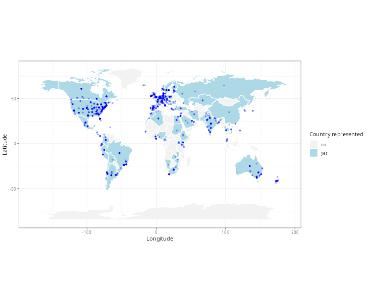

This is an example .qmd file, being used to debug the pull request process. 

# Loading File

```{r}
file <- list.files("data", full.names=TRUE, pattern=".fcs")
flowCore::read.FCS(file, transformation = FALSE, truncate_max_range = FALSE)
```

# Current Class Image

