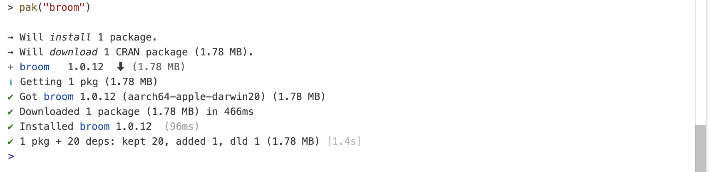
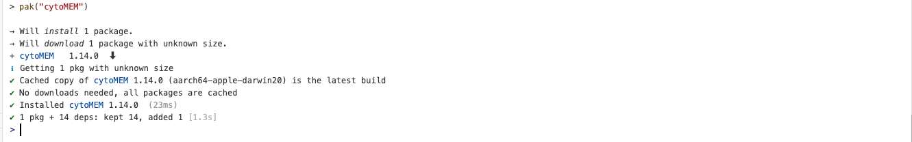
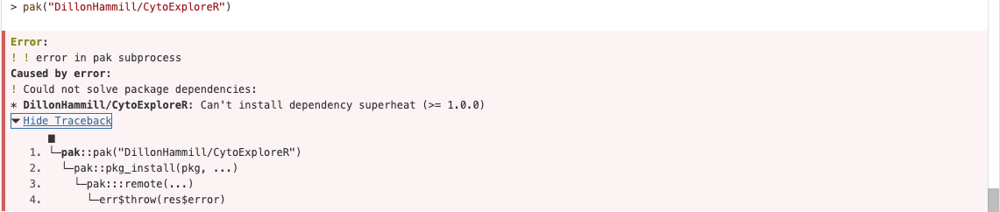
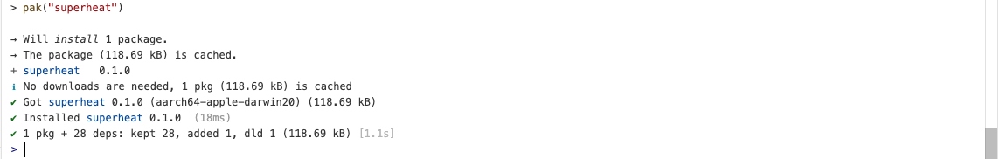
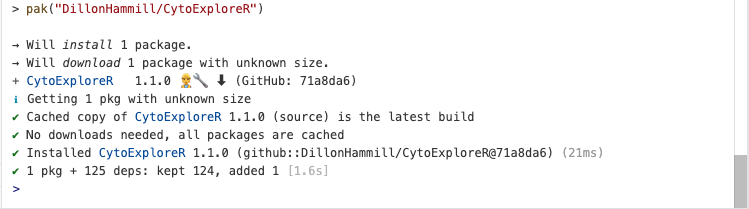

# [PeacoQC]{.underline}

PeacoQC is a package that performs quality control on FCS files - it can remove anomalies caused by clogging or variable flow rate that occurs when acquiring events from a flow cytometer. Its workflow requires assigning variables and working through step by step to result in cleaned flow data. FlowCore is a dependency package needed for it to function; briefly it allows for basic manipulation of flow data.

The basic workflow of the package begins with an initial step of assigning the path for your FCS file, and then reading the FCS file you assigned with FlowCore:
```{r}
#| eval: false
fileName <- system.file("extdata", "111.fcs", package="PeacoQC")
ff <- flowCore::read.FCS(fileName)
```

The next step is then defining the channels where margin/axes events are removed and which channels the QC should be performed. **This step should be performed before compensating and transforming any data:**

```{r}
#| eval: false
channels <- c(1, 3, 5:14, 18, 21)
ff <- RemoveMargins (ff=ff, channels=channels,output="frame")
```

The next step is compensation and transformation of your data:

```{r}
#| eval: false
ff <- flowCore::compensate(ff, flowCore::keyword(ff)$SPILL)
ff <- flowCore::transform(ff, flowCore::estimateLogicle(ff, colnames(flowCore::keyword(ff)$SPILL)))
```

The final step is then performing the QC, saving the cleaned flow file, and plotting results of this step:

```{r}
#| eval: false
PeacoQC_res <- PeacoQC(ff=ff, channels=channels, determine_good_cells = "all", save_fcs = TRUE, plot=TRUE, output_directory = "PeacoQC_Example1")
```

# [Bioconductor Packages]{.underline}
There are currently 69 bioconductor packages for flow cytometry. Mike Jiang has the most packages maintained/developed. Of all the packages, the ones of most interest and relevance to my professional work include:

flowCore, flowViz, FlowSOM, ggcyto, CATALYST, PeacoQC, flowDensity, flowClean, flowCut, flowCHIC, flowGate, flowPlots. These packages seem to be the ones most useful for data visualisation, gating, and cleanup relevant for our flow cytometry analysis and outputs in projects within our company.

# [pak Package]{.underline}
## CRAN & Bioconductor packages
pak greatly simplifies installation of packages from CRAN, Bioconductor, and github, by removing the need for typing different functions depending on the repository you are downloading from:

```{r}
#| eval: false
# For CRAN or Bioconductor repositories rather than running
# install("xyz") or install.packages("xyz")
# You can run
# pak("xyz")
```

For example, when downloading the package broom, it appears as the following in the console:

```{r}
#| eval: false
pak("broom")
```

{width=100%}

And similarly when downloading cytoMEM, it appears like this:

```{r}
#| eval: false
pak("cytoMEM")
```

{width=100%}

## Github: downloading CytoExploreR
Generally:
```{r}
#| eval: false
# for github rather than 
# install_github("abc/xyz")
# You can run
# pak("abc/xyz")
```

However, when initially attempting install CytoExploreR this way, the following message appeared:

```{r}
#| eval: false
pak("DillonHammill/CytoExploreR")
```
{width=100%}

So I attempted to install superheat independently initially using the pak function:

```{r}
#| eval: false
pak("superheat")
```

{width=100%}

I then tried to install CytoExploreR again, however the same error message as previous kept appearing. I noticed the superheat version that was installed (0.1.0) did not match the version required as a dependency for CytoExploreR (>= 1.0.0). I believe using the pak function to install superheat defaulted to installing the CRAN version, which was outdated. 

To fix this, I searched for the appropriate version, which was available on github, and installed that specifically:

```{r}
#| eval: false
pak("rlbarter/superheat")
```

{width=100%}

Installing CytoExploreR was then able to complete successfully:
{width=100%}

I believe the lesson from this is to check the version(s) of the dependency package(s) required when attempting installation of certain packages, and learning that pak may not always default to downloading the correct version you need.