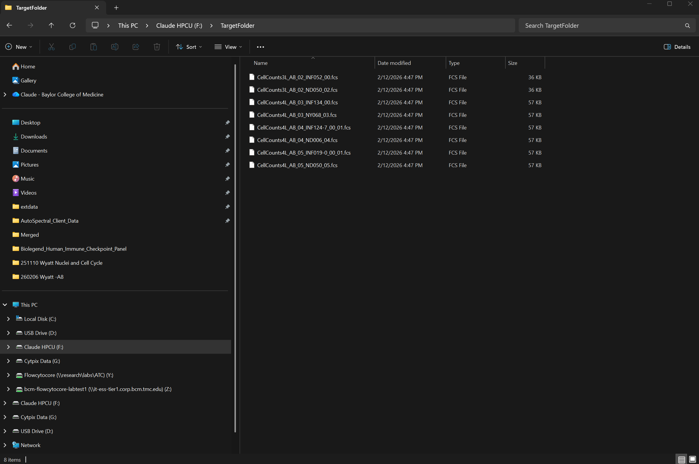
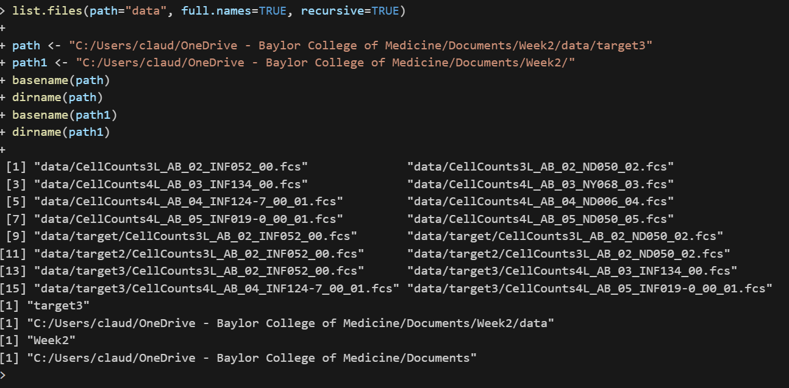
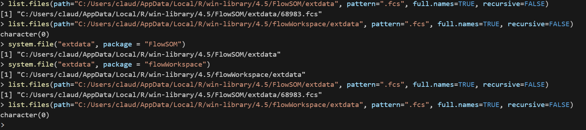

# Problem 1
Plug in an external hard-drive or USB into your computer. Manually, create a folder within called “TargetFolder”. Try to programmatically specify the file path to identify the folders and files present on your external drive. Then, try to copy your .fcs files from their current folder on your desktop to the TargetFolder on your drive using R. Remember, just copy, no deletion, you need to walk before you can run :D

```{r}
FCSTargetFolder <- "F:/TargetFolder"
FCS <- list.files("C:/Users/claud/OneDrive - Baylor College of Medicine/Documents/Week2/data", pattern=".fcs$", full.names=TRUE, recursive = FALSE)
library(stringr)
str_detect(FCS, "fcs")
FCS[str_detect(FCS,"fcs")]
FCSFiles <- FCS[str_detect(FCS, "fcs")]
file.copy(from=FCSFiles, to="F:/TargetFolder/")
```



# Problem 2
In this session, we used list.files() with the “full.names argument” set to TRUE, as well as the basename() function to identify specific files. But what if you wanted a particular directory. Run list.files() with “full.names argument” and “recursive” argument set to TRUE, and then search online to find an R function that would retrieve the “” individual directory folders.

Clarification from email:
Hi @claude-chew and @jttoivon, sorry for the unclear question! What I would be looking for would a function that would be able to isolate lets say either data or Cytometry in R from the following file path:

C:/Users/JohnDoe/Documents/CytometryInR/course/02_FilePaths/datra/target3

```{r}
list.files(path="data", full.names=TRUE, recursive=TRUE)

path <- "C:/Users/claud/OneDrive - Baylor College of Medicine/Documents/Week2/data/target3"
path1 <- "C:/Users/claud/OneDrive - Baylor College of Medicine/Documents/Week2/"
basename(path)
dirname(path)
basename(path1)
dirname(path1)

```



# Problem 3
R packages often come with internal datasets, that are typically used for use in the help documentation examples. These can be accessed through the use of the system.file() function. See an example below.

system.file("extdata", package = "FlowSOM")

Using what we have learned about file.path navigation, search your way down the file.directory of the FlowSOM and flowWorkspace packages, and identify any .fcs files that are present for use in the documentation.


```{r}
system.file("extdata", package = "FlowSOM")
system.file("extdata", package = "flowWorkspace")

list.files(path="C:/Users/claud/AppData/Local/R/win-library/4.5/FlowSOM/extdata", pattern=".fcs", full.names=TRUE, recursive=FALSE)
list.files(path="C:/Users/claud/AppData/Local/R/win-library/4.5/flowWorkspace/extdata", pattern=".fcs", full.names=TRUE, recursive=FALSE)
```

