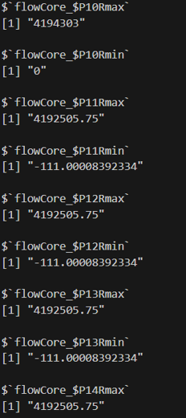
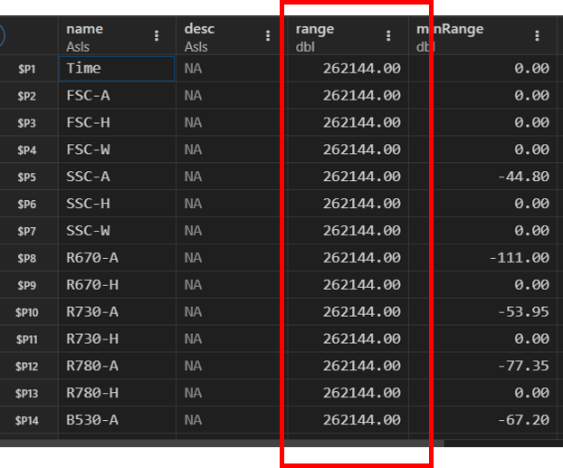
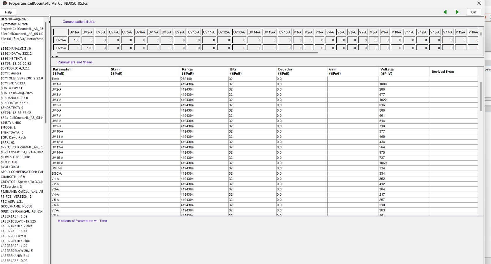

# Problem 1

*See if you can catalog the main differences that occured to the keyword, parameters and exprs in the unmixed .fcs file (2025_07_26…). Did any keywords get added, changed, deleted entirely? etc.*

**Answer:** 

```{r}
#| eval: false
unmix_fcs_file <- list.files("data", pattern = "NY068", full.names = TRUE, recursive = TRUE)
```
```{r}
#| eval: false
read.FCS(filename = unmix_fcs_file)
```
```{r}
#| eval: false
flowFrame2 <- read.FCS(filename=unmix_fcs_file, transformation = FALSE, truncate_max_range = FALSE)

ParameterData2 <- flowFrame2@parameters@data
DescriptionList2 <- flowFrame2@description
```

```{r}
#| eval: false
ParameterData2
```


```{r}
#| eval: false
DescriptionList2[320:405]
```


```{r}
#| eval: false
DescriptionList2$`$P11V`
```
[1] "0"

```{r}
#| eval: false
DescriptionList2$`$P12V`
```
[1] "0"

```{r}
#| eval: false
DescriptionList2$`$P13V`
```
[1] "0"


The main differences I noticed between the two files are that in the "2025_07_26…" file:

1. The detectors have been named after the fluorochrome they detect, and a description has been added to the fluorescence detectors.
2. In the "description" slot within the "flowFrame" we can see that:

    2.1. Additional keywords have been added by flowCore.

    2.2. The keywords corresponding to the fluorescence detector voltage values have been changed to 0.

# Problem 2

*Explore the "2025-10_22…" file and see if you find any major differences*

**Answer:**

```{r}
#| eval: false
conv_fcs_file <- list.files("data", pattern = "Contrad", full.names = TRUE, recursive = TRUE)
```

```{r}
#| eval: false
flowFrame3 <- read.FCS(filename=conv_fcs_file)
```

```{r}
#| eval: false
ParameterData3 <- flowFrame3@parameters@data
```


```{r}
#| eval: false
DescriptionList3 <- flowFrame3@description
DescriptionList3
```

Major differences found:

1. The "2025-10_22…" file comes from a cytometer with an 18-bit dynamic range, whereas the spectral files come from a 22-bit cytometer.

2. This file contains a set of additional keywords that seem to be specific to the "FACSDiva" acquisition software. Among these specific keywords, the most relevant ones for me are:
- AUTOBS: Idicates whether or not Biexponential scale values were set automatically (true) or manually (false).
- PnBS: Indicates the automatically set Biexponential scale value for parameter n.
- PnMS: Indicates the manually set Biexponential scale value for parameter n.

# Problem 3

*If you have access to commercial software, take one of the .fcs files and try to see if you can see similar internal information from within the software.*

**Answer:**

I have access to FlowJo software, and I have been able to see similar internal information from within the software.

