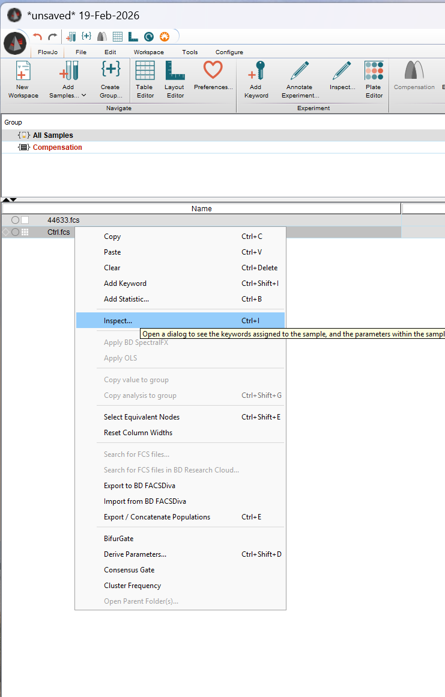
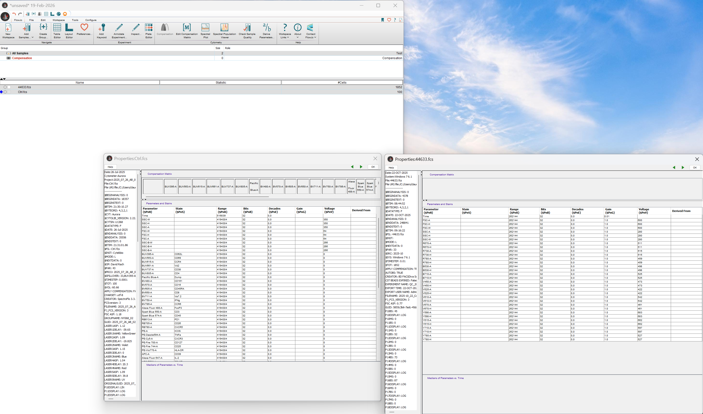

# Problem 1
Today’s walkthrough focused on a raw spectral flow cytometry file. Within a subfolder in data you will also find an unmixed .fcs file (2025_07_26…). Using what learned to day, investigate it, and see if you can catalog the main differences that occured to the keyword, parameters and exprs. Did any keywords get added, changed, deleted entirely? etc.


# Problem 1 Code
```{r}
PathToDataFolder <- file.path("data/AdditionalFCSFiles")
PathToDataFolder

# Locate .fcs files
fcs_files <- list.files(PathToDataFolder, pattern=".fcs", full.names=TRUE)
fcs_files

# Locate unmixed .fcs file
unmixed_file <- list.files(PathToDataFolder, pattern="2025_07_26", full.names=TRUE)
unmixed_file

# Read unmixed .fcs file
library(flowCore)
read.FCS(filename=unmixed_file)
flowFrame <- read.FCS(filename=unmixed_file, transformation = TRUE, truncate_max_range = FALSE)
class(flowFrame)
MFI_Matrix <- flowFrame@exprs
ColumnNames <- colnames(MFI_Matrix)
class(ColumnNames)

# Explore parameters
ParameterData <- flowFrame@parameters@data
str(ParameterData)

# Explore Description
DescriptionList <- flowFrame@description
DescriptionList
class(DescriptionList)
str(DescriptionList)
DescriptionList$`$SPILLOVER`
Subset <- DescriptionList[1:18]
DescriptionList$`$BTIM`
DescriptionList$`$CYT`
DescriptionList$`$CYTSN`
DescriptionList$`$DATE`
DescriptionList$`$ETIM`
DescriptionList$`$FIL`
DescriptionList$`$OP`
Detectors <- DescriptionList[20:384]
Detectors
DescriptionList$`$P7B`
DescriptionList$`$P7E`
DescriptionList$`$P7N`
DescriptionList$`$P7R`
DescriptionList$`$P7TYPE`
DescriptionList$`$P7V`
# keyword(flowFrame)
```

# Differences with raw file
- Instead of raw channel names such as "UV1-A", "UV2-A" etc., there are fluorophore names such as "BUV395-A".
- There are 43 columns instead of 61, indicating that raw channels have been removed and only unmixed channels remain in the data file.
    - $`$PAR` keyword is 43 in this file vs 61 in raw file
- There is now a "TYPE" keyword added:
    - e.g. $`$P40TYPE` that gives a value of "Unmixed_fluorescence"
- There are marker names such as "CD107a" in the desc column.
- "$transformation" keyword now has "custom" value

# Problem 2
Today’s files were for spectral .fcs files from a Cytek Aurora within a subfolder in data you will also find a conventional flow cytometry file (2025-10_22…). Similarly, explore and see if you find any major differences (beyond the different detector or fluorophore names which will vary based on antibody panel used, etc)


```{r}
PathToDataFolder <- file.path("data/AdditionalFCSFiles")
PathToDataFolder

# Locate .fcs files
fcs_files <- list.files(PathToDataFolder, pattern=".fcs", full.names=TRUE)
fcs_files

# Locate unmixed .fcs file
conventional_file <- list.files(PathToDataFolder, pattern="2025-10_22", full.names=TRUE)
conventional_file

# Read unmixed .fcs file
library(flowCore)
read.FCS(filename=conventional_file)
flowFrame <- read.FCS(filename=conventional_file, transformation = TRUE, truncate_max_range = FALSE)
class(flowFrame)
MFI_Matrix <- flowFrame@exprs
ColumnNames <- colnames(MFI_Matrix)
class(ColumnNames)

# Explore parameters
ParameterData <- flowFrame@parameters@data
str(ParameterData)

# Explore Description
DescriptionList <- flowFrame@description
class(DescriptionList)
str(DescriptionList)
DescriptionList$SPILL
# keyword(flowFrame)
```

# Differences in conventional file
- Channel names show both area and height parameters
- There are 33 columns, i.e. 33 parameters
- There is an "APPLY COMPENSATION" keyword that has the value "TRUE"
- "CREATOR" keyword indicates an old cytometer using FACSDiva 8.0.2
- "$SYS" keyword indicates old PC running Windows 7.6.1
- The parameter keywords for each parameter have 7 variations instead of 6 in spectral file
- "SPILL" keyword displays compensation matrix vs "$SPILLOVER" keyword in Aurora data


# Problem 3
If you have access to commercial software, take one of the .fcs files and try to see if you can see similar internal information from within the software. For those without commercial access, try the equivalent process using Floreada.io.



