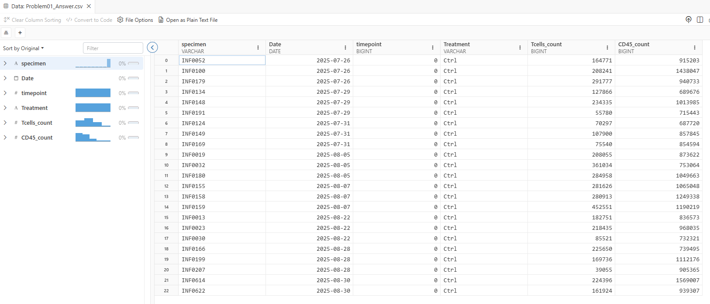
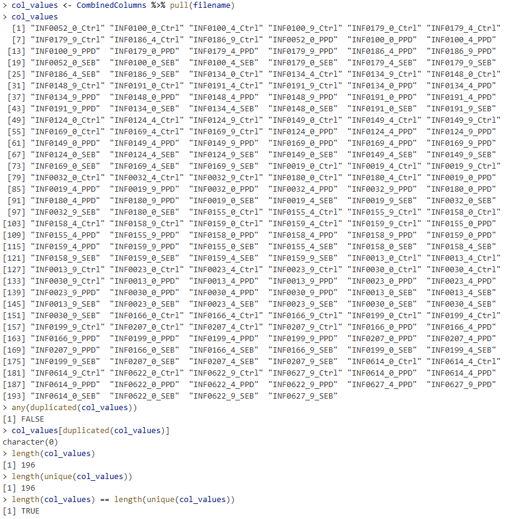

# Problem 1

Taking a dataset (either todays or one of your own), work through the column-operating functions (select(), rename(), and relocate()). Once this is done, filter() by conditions from two separate columns, arrange in an order that makes sense, and export this “tidy” data as a .csv file.

## Answer 1

# Problem 2

We used the mutate() function to create new columns, but it can also be used to modify existing ones. Various numeric columns are showing way to many significant digits. As was shown, use round() to round all these proportion columns, but use mutate to overwrite the existing column. Export this as it’s own .csv file.

## Answer 2

[label](data/Problem02_Answer.csv)

# Problem 3

We can also use mutate() to combine columns. For our dataset, “bid”, “timepoint”, “Condition” are separate columns that originally were all part of the filename for the individual .fcs file. Try to figure out a way to combine them back together using paste0(), and save the new column as “filename”. Once this is done, pull() the contents of this column, and using try to determine whether there were any duplicates (think innovative ways of using !, length() and unique())

## Answer 3

There are no duplicate files.

