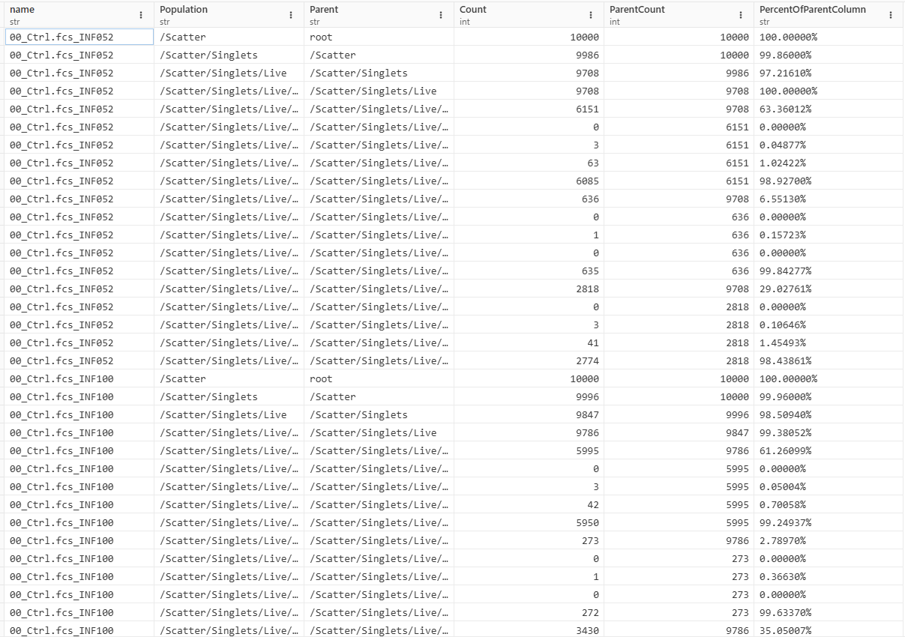
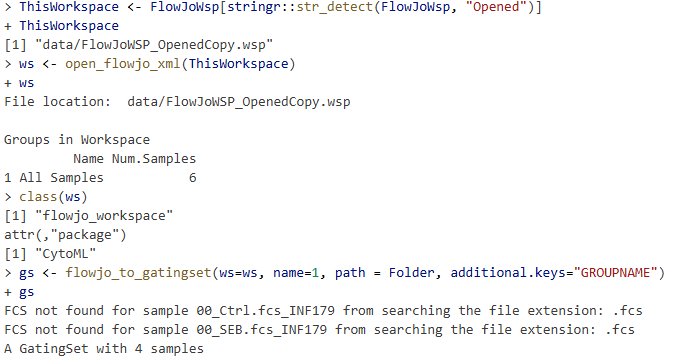
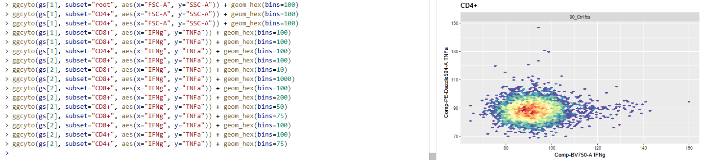

# Problem 1

Using what you learned last week in Introduction to Tidyverse, for the imported GatingSet, retrieve the data.frame from cell counts per gate and attempt to mutate a new column showing percent of the parent gate. Remember, this is intentionally tricky at this point, we will go over how to efficiently do this in a few weeks.

# Answer 1

# Problem 2

As we saw, CytoML can be finicky when names are repeated, or .fcs files are not present. Try removing a couple of the .fcs files from the data folder, and re-run the code. Document what kind of errors result.

# Answer 2

# Problem 3

For ggcyto, attempt to generate plots to visualize TNFa and IFNg for the various cell populations, across both Ctrl and SEB samples. In the process, change the bins argument until you end up with a resolution that you would be happy with for your own plots, and write it down.

# Answer 3

