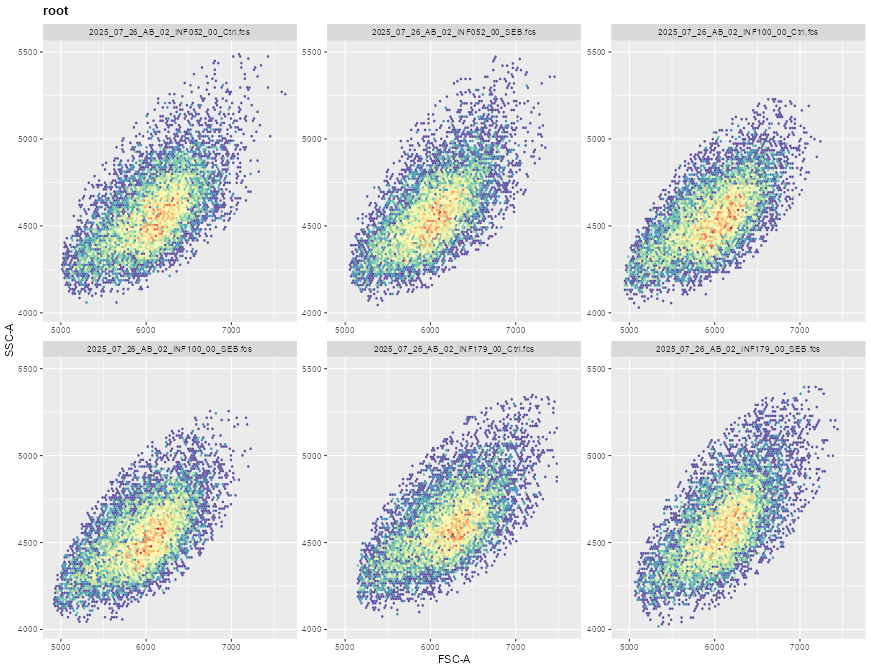
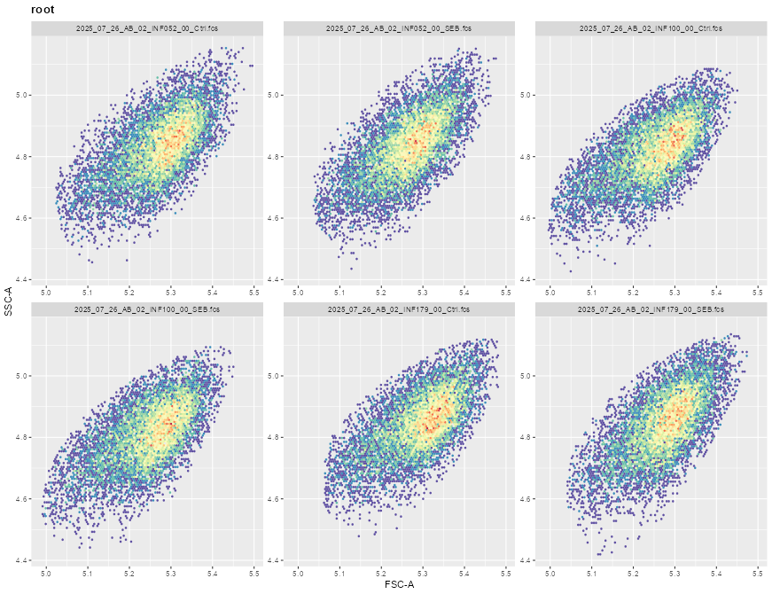
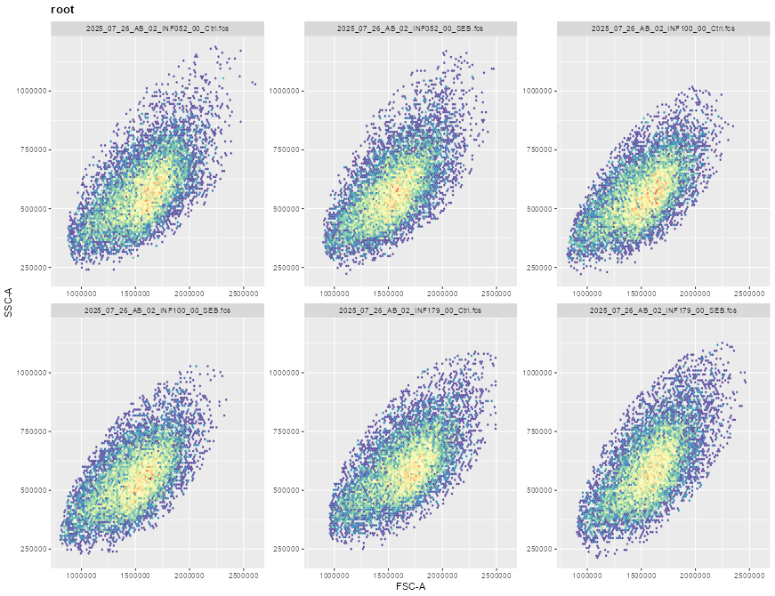
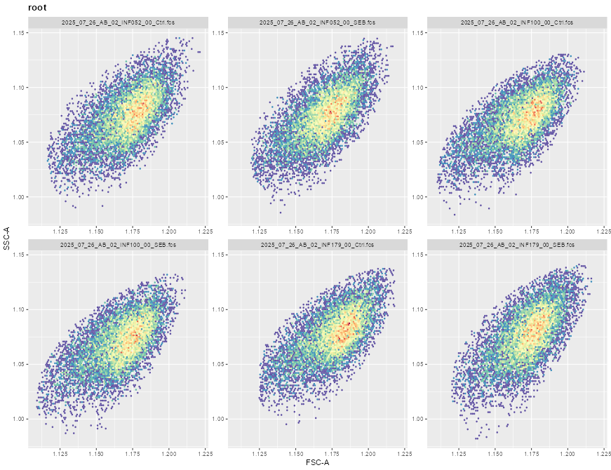
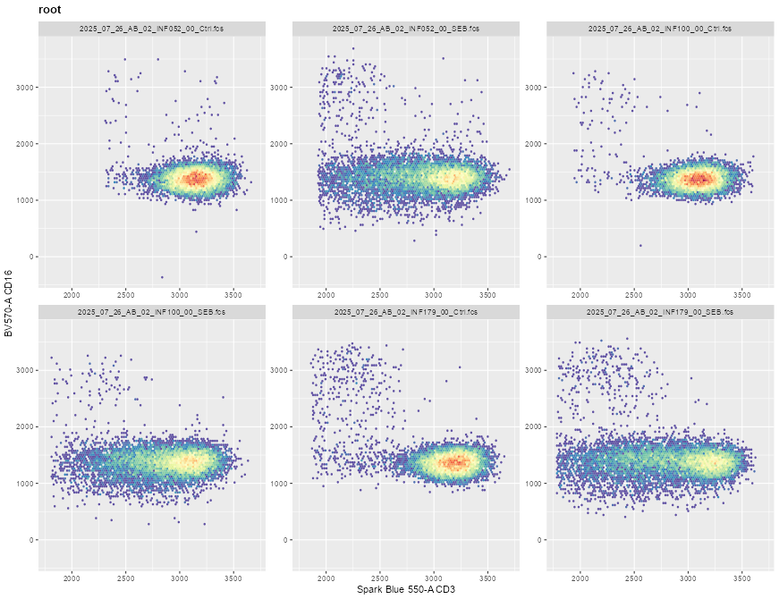
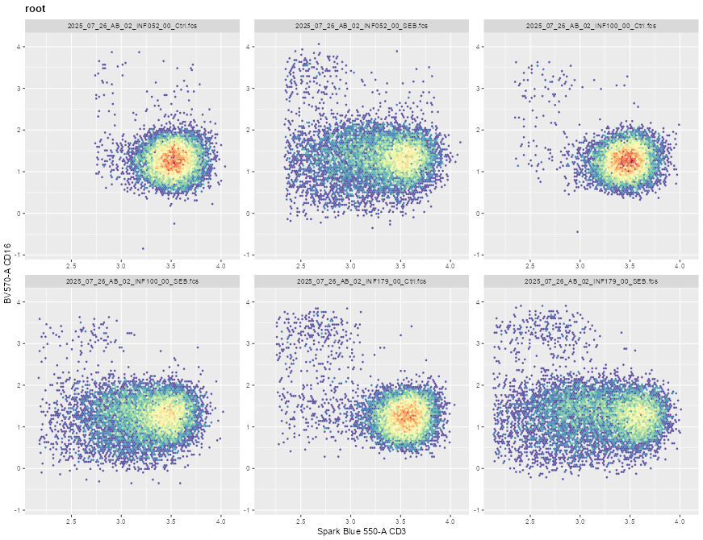
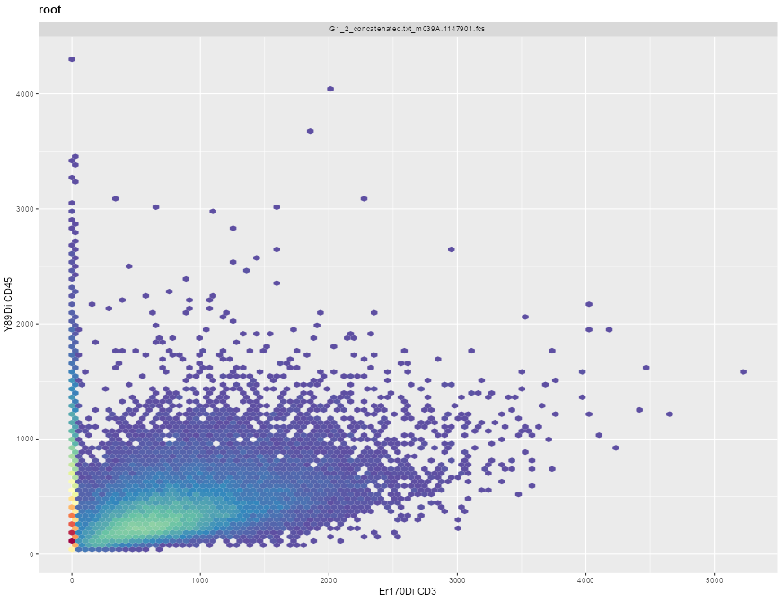

# Take-home Problems
# Problem 1
We had not selected FSC and SSC parameters in this attempt, as they are normally displayed in the linear scale. Include them in the list of fluorophores to be transformed, and see how this impacts the visualization (imitating what could accidentally happen in practice if they were left in)

```{r}
library(flowWorkspace)
library(ggcyto)
library(dplyr)
library(stringr)
library(ggcyto)

# Read in the FCS files
StorageLocation <- file.path("data") #When Quarto Rendering

fcs_files <- list.files(StorageLocation, ".fcs", full.names=TRUE)
SFC_files <- fcs_files[stringr::str_detect(fcs_files, "2025")]
MC_files <- fcs_files[stringr::str_detect(fcs_files, "G1_2")]

SFC_files

SFC_cytoset <- load_cytoset_from_fcs(SFC_files, truncate_max_range = FALSE, transformation = FALSE)
SFC_GatingSet <- GatingSet(SFC_cytoset)

SFC_GatingSet

# Assign a variable that contains FSC and SSC parameters

colnames(SFC_GatingSet)
SFC_Parameters <- colnames(SFC_GatingSet)
SFC_Parameters

AllParameters <- SFC_Parameters[!stringr::str_detect(SFC_Parameters, "Time")]
AllParameters

# Assign Transforms

Logicle <- logicle_trans()
str(Logicle)

Biexponential <- flowjo_biexp_trans()
str(Biexponential)

Asinh <- flowjo_fasinh_trans()
str(Asinh)

AsinhGML <- asinhtGml2_trans()
str(AsinhGML)

# Perform Transforms

# Biexponential Transform
SFC_cytoset <- load_cytoset_from_fcs(SFC_files,
 truncate_max_range = FALSE, transformation = FALSE)
SFC_GatingSet <- GatingSet(SFC_cytoset)
Biexponential <- flowjo_biexp_trans(channelRange=4096, maxValue=262144,
     pos=4.5, neg=0, widthBasis=-100)
MyBiexTransform <- transformerList(AllParameters, Biexponential)
transform(SFC_GatingSet, MyBiexTransform)

ggcyto(SFC_GatingSet, subset="root",
    aes(x="FSC-A", y="SSC-A")) + geom_hex(bins=100)

```



```{r}
# Logicle Transform

SFC_cytoset <- load_cytoset_from_fcs(SFC_files,
 truncate_max_range = FALSE, transformation = FALSE)
SFC_GatingSet <- GatingSet(SFC_cytoset)
Logicle <- logicle_trans(w = 0, t=262144, m = 4.5, a=0)
MyLogicleTransform <- transformerList(AllParameters, Logicle)
transform(SFC_GatingSet, MyLogicleTransform)

ggcyto(SFC_GatingSet, subset="root",
    aes(x="FSC-A", y="SSC-A")) + geom_hex(bins=100)
```



```{r}
# Asinh Transform

SFC_cytoset <- load_cytoset_from_fcs(SFC_files,
 truncate_max_range = FALSE, transformation = FALSE)
SFC_GatingSet <- GatingSet(SFC_cytoset)
Asinh <- flowjo_fasinh_trans(m = 4, t=262144, a=0.7, length = 256)
MyAsinhTransform <- transformerList(AllParameters, Asinh)
transform(SFC_GatingSet, MyAsinhTransform)

ggcyto(SFC_GatingSet, subset="root",
    aes(x="FSC-A", y="SSC-A")) + geom_hex(bins=100)
```



```{r}
# AsinGML

SFC_cytoset <- load_cytoset_from_fcs(SFC_files,
 truncate_max_range = FALSE, transformation = FALSE)
SFC_GatingSet <- GatingSet(SFC_cytoset)
AsinGML <- asinhtGml2_trans(T = 262144, M=4.5, A=0)
MyAsinGMLTransform <- transformerList(AllParameters, AsinGML)
transform(SFC_GatingSet, MyAsinGMLTransform)

ggcyto(SFC_GatingSet, subset="root",
    aes(x="FSC-A", y="SSC-A")) + geom_hex(bins=100)
```



# Transformations affect min/max values for FSC SSC and skew where it appears the median of the population appears slightly higher for FSC SSC or lower depending on the transform.

# Problem 2
For the SFC data, I showed the setup for both Logicle and Biexponential, but didn’t have time to dive into the Logicle transformation. Select a couple markers of interest for the SFC data, visualize and screenshot the before, and then attempt to customize the biexponential arguments to best visualize the underlying data, and then repeat for Logicle. Take screenshots of both and compare/contrast the difference.

```{r}
# Find out marker names
markernames(SFC_GatingSet)

# Assign Transforms

Biexponential <- flowjo_biexp_trans()
str(Biexponential)

Logicle <- logicle_trans()
str(Logicle)


# Biexponential Transform
SFC_cytoset <- load_cytoset_from_fcs(SFC_files,
 truncate_max_range = FALSE, transformation = FALSE)
SFC_GatingSet <- GatingSet(SFC_cytoset)
Biexponential <- flowjo_biexp_trans(channelRange=4096, maxValue=262144,
     pos=4.5, neg=0, widthBasis=-1000)
MyBiexTransform <- transformerList(AllParameters, Biexponential)
transform(SFC_GatingSet, MyBiexTransform)

ggcyto(SFC_GatingSet, subset="root",
    aes(x="CD3", y="CD16")) + geom_hex(bins=100)
```



```{r}
# Logicle Transform

SFC_cytoset <- load_cytoset_from_fcs(SFC_files,
 truncate_max_range = FALSE, transformation = FALSE)
SFC_GatingSet <- GatingSet(SFC_cytoset)
Logicle <- logicle_trans(w = 1.25, t=262144, m = 4.5, a=0)
MyLogicleTransform <- transformerList(AllParameters, Logicle)
transform(SFC_GatingSet, MyLogicleTransform)

ggcyto(SFC_GatingSet, subset="root",
    aes(x="CD3", y="CD16")) + geom_hex(bins=100)
```



The final output is similar, it seemed easier with logicle transformation to display the distribution of the events in each population for CD3 or CD16.

# Problem 3
There are to asinh style transformations provided by the flowWorkspace package. Using the mass cytometry data, select two metal markers of interest, visualize each, customize the arguments until you have properly visualized the underlying populations, and see if you can spot any major differences between the methods.

```{r}
# Read in the MC files

MC_files <- fcs_files[stringr::str_detect(fcs_files, "G1_2")]

MC_cytoset <- load_cytoset_from_fcs(MC_files, truncate_max_range = FALSE, transformation = FALSE)
MC_GatingSet <- GatingSet(MC_cytoset)

MC_GatingSet

# Inspect markers
colnames(MC_GatingSet)
markernames(MC_GatingSet)

MC_Parameters <- markernames(MC_GatingSet)

# Asinh Transformation of MC data

MC_cytoset <- load_cytoset_from_fcs(MC_files,
 truncate_max_range = FALSE, transformation = FALSE)
MC_GatingSet <- GatingSet(MC_cytoset)
Asinh <- flowjo_fasinh_trans(m =4.5, t = 12000, a =1, length = 256)
MyAsinhTransform <- transformerList(MC_Parameters, Asinh)
transform(MC_GatingSet, MyAsinhTransform)

ggcyto(MC_GatingSet[1], subset="root",
 aes( x="CD3", y="CD45")) + geom_hex(bins=100)
```



```{r}
#AsinGML Transformation of MC Data

MC_cytoset <- load_cytoset_from_fcs(MC_files,
 truncate_max_range = FALSE, transformation = FALSE)
MC_GatingSet <- GatingSet(MC_cytoset)
AsinGML <- asinhtGml2_trans(T = 12000, M=4.5, A=1)
MyAsinGMLTransform <- transformerList(MC_Parameters, AsinGML)
transform(MC_GatingSet, MyAsinGMLTransform)

ggcyto(MC_GatingSet[1], subset="root",
 aes( x="CD3", y="CD45")) + geom_hex(bins=100)
```


I notice no major differences between Asinh and AsinGML transformation of MC data.