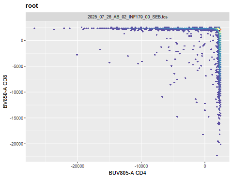
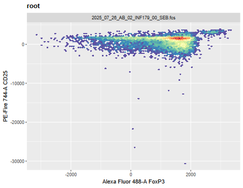
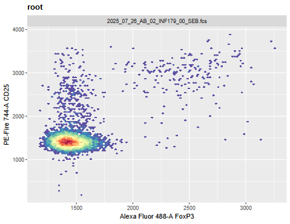
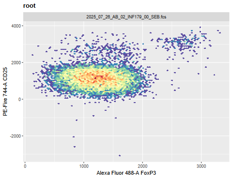
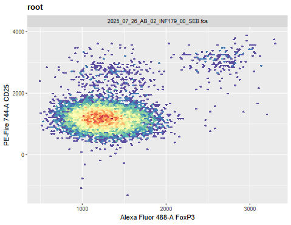
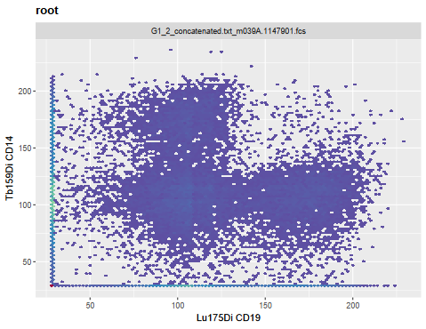
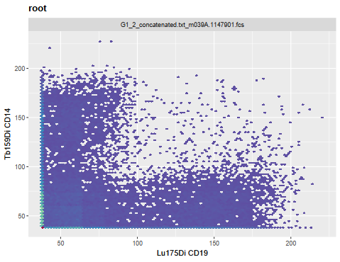
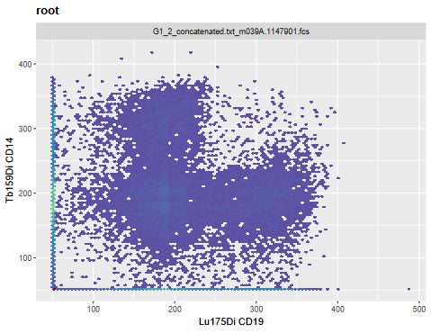

# Problem 1

We had not selected FSC and SSC parameters in this attempt, as they are normally displayed in the linear scale. Include them in the list of fluorophores to be transformed, and see how this impacts the visualization (imitating what could accidentally happen in practice if they were left in).

# Answer 1

The dots are shifted to the upper right corner of the plot when FSC & SSC are included.  No changes in the values for the transformation arguments were able to fix the placement of the dots sufficiently on the plot.

# Problem 2

For the SFC data, I showed the setup for both Logicle and Biexponential, but didn’t have time to dive into the Logicle transformation. Select a couple markers of interest for the SFC data, visualize and screenshot the before, and then attempt to customize the biexponential arguments to best visualize the underlying data, and then repeat for Logicle. Take screenshots of both and compare/contrast the difference.

# Answer 2

# Biexponential before and after

# Logicle before and after

The negative population (set at -200) is wider with Logicle settings compared to biexponential (set at -1000).

# Problem 3

There are two asinh style transformations provided by the flowWorkspace package. Using the mass cytometry data, select two metal markers of interest, visualize each, customize the arguments until you have properly visualized the underlying populations, and see if you can spot any major differences between the methods.

# Answer 3

# Asinh before and after

The populations were able to be properly visualized by changing the m value from 4 to 5.5.

# AsinhGML before and after

Same result with AshihGML as was with Asinh.
