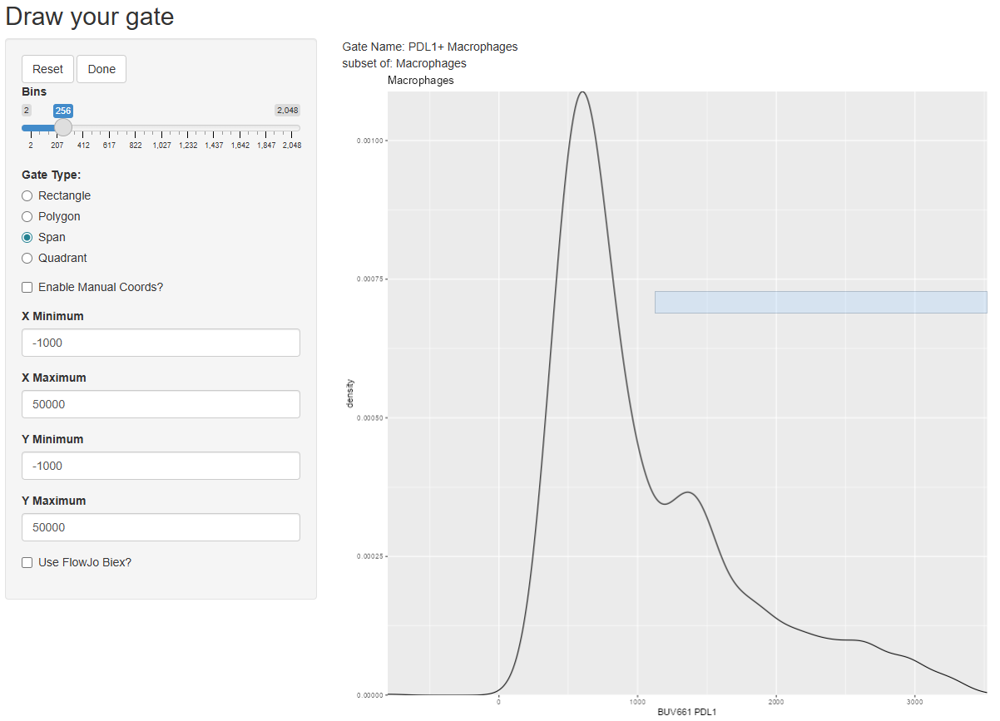

## Problem 1

### Using `flowGate`, go ahead and create your own series of gates for either our data or your own for any cell populations that might interest you. Once done, save the GatingSet, and then successfully reload it. Add another gate, but intentionally misdraw it. Then proceed to visualize, identify and correct it, before saving again.

We start by loading the libraries.

```{r}
library(flowWorkspace)
library(ggplot2)
library(ggcyto)
library(flowGate)
library(openCyto)
library(Luciernaga) #Will try to downsample files
```

I have loaded a couple of unmixed .fcs files from my data. First, I will try to downsample them. I start by importing them into a GatingSet object.

```{r}
total.data.location <- file.path("data")
total.files.list <- list.files(total.data.location, full.names = T, pattern = ".fcs")
total.cs <- load_cytoset_from_fcs(total.files.list, transformation = F, truncate_max_range = F)
total.gs <- GatingSet(total.cs)
```

Now, we downsample them and save the files into a new folder

```{r}
 ds.data.location <- file.path("downsampled data")
purrr::walk(.x=total.gs, .f=Utility_Downsample,
 sample.name=c("$PROJ", "GROUPNAME", "TUBENAME"),
 export=TRUE, outpath=ds.data.location,
  subsample=40000, subsets="root", inverse.transform=FALSE)
```

It worked! Now, I will clean the environment and import the downsampled files

```{r}
rm(total.data.location)
rm(total.files.list) 
rm(total.cs) 
rm(total.gs)
ds.files.list <- list.files(ds.data.location, full.names = T, pattern = ".fcs")
ds.cs <- load_cytoset_from_fcs(ds.files.list, transformation = F, truncate_max_range = F)
ds.gs <- GatingSet(ds.cs)
```

These samples come from mouse tumors, so they look dirtier than the ones we have previously worked with. We will start by observing the data:

```{r}
ggcyto(ds.gs[1], subset = "root", aes(x = "FSC-A", y = "SSC-A")) + geom_hex(bins = 128)
ggcyto(ds.gs[1], subset = "root", aes(x = "FSC-A", y = "FSC-H")) + geom_hex(bins = 128)
```

Now, let's follow with removing doublets and debris:

```{r}
#| eval: FALSE
gs_gate_interactive(ds.gs, filterId = "singlets", dims = list("FSC-A", "FSC-H"), subset = "root")
```

```{r}
#| eval: FALSE
gs_gate_interactive(ds.gs, filterId = "cells", dims = list("FSC-A", "SSC-A"), subset = "singlets")
```

 

Next thing would be to subset live leukocytes (LiveDead Blue- CD45+). In order to use fluorescent parameters, we first need to transform the data

```{r}
#| eval: FALSE
# ds.gs.backup <- ds.gs #For not having to redo gating while trying transformation arguments
# save_gs(ds.gs.backup, file.path(ds.data.location, "Backup GS.gs"))
ds.gs.backup <- load_gs(file.path(ds.data.location, "Backup GS.gs"))
ds.gs <- ds.gs.backup
channels <- colnames(ds.gs)
fluorophores <- channels[!stringr::str_detect(channels, "FSC|SSC|Time")]
biexp <- flowjo_biexp_trans(channelRange=4096, maxValue=262144,
     pos=4.5, neg=0, widthBasis=-1000) 
biexp.list <- transformerList(fluorophores, biexp)
transform(ds.gs, biexp.list)
ggcyto(ds.gs[1], subset = "cells", aes(x = "Live-Dead Blue", y = "Alexa Fluor 700")) + geom_hex(bins = 128)
```

Transformation seems to work fine, but some negative events (probably debris) actually alter the plot. I've made some research and setting axis limits in the ggcyto doesn't work (because it always tries to fit every value). Removing those values should work, but we can also use manual ranges in the gating:

```{r}
#| eval: FALSE
gs_gate_interactive(ds.gs, filterId = "live cells", dims = list("Live-Dead Blue", "Alexa Fluor 700"), subset = "cells")
```


Finally, I will try to gate some main populations, and then will correct one gating using `regate`:

```{r}
#| eval: FALSE
ggcyto(ds.gs[1], subset = "live cells", aes(x = "Ly6G", y = "CD11b")) + geom_hex(bins = 128) #Huge neutrophil population
gs_gate_interactive(ds.gs, "neutrophils", dims = list("Ly6G", "CD11b"), subset = "live cells")
```


Oops! Now we need to regate:

```{r}
#| eval: FALSE
gs_gate_interactive(ds.gs, "neutrophils", dims = list("Ly6G", "CD11b"), subset = "live cells", regate = T)
```


That's better. Last two gates to try the quad option:

```{r}
#| eval: FALSE
gs_gate_interactive(ds.gs, "not neutrophils", dims = list("Ly6G", "CD11b"), subset = "live cells")
```


```{r}
#| eval: FALSE
gs_gate_interactive(ds.gs, "NK/T cells", dims = list("NK1.1", "CD3"), subset = "not neutrophils")
```


Finally, we save it and try to import it:

```{r}
#| eval: FALSE
save_gs(ds.gs, file.path(ds.data.location, "Manual Gating set.gs"))
plot(ds.gs)
```

Now we remove it from the environment and try to import it again:

```{r}
#| eval: FALSE
rm(ds.gs)
ds.gs <- load_gs(file.path(ds.data.location, "Manual Gating set.gs"))
plot(ds.gs)
```

## Problem 2

### Go ahead and create your own `openCyto` gate template, extending to whatever cell target population of interest. Visualize the differences, and ensure that the gates are correctly applied for everyone. Set gate_constaint arguments as needed until everything is just right.
I start by opening the csv file (sorry for the csv2 format from Spanish OS :(, although it doesn't make a difference for the fread function).
```{r}
template <- data.table::fread("opencyto_template.csv")
template
```

Heads up I modified the parameters for the flowClust method in order to get all leukocytes (the small population with higher FSC-A and SSC-A values are tumor-associated macrophages). Second step is creating the gating template.
```{r}
gate.template <- gatingTemplate(template)
```

Now we import the .fcs files from the first exercise and perform the same transformation.
```{r}
ds.data.location <- file.path("downsampled data")
ds.files.list <- list.files(ds.data.location, full.names = T, pattern = ".fcs")
ds.cs <- load_cytoset_from_fcs(ds.files.list, transformation = F, truncate_max_range = F)
ds.gs <- GatingSet(ds.cs)
channels <- colnames(ds.gs)
fluorophores <- channels[!stringr::str_detect(channels, "FSC|SSC|Time")]
biexp <- flowjo_biexp_trans(channelRange=4096, maxValue=262144,
     pos=4.5, neg=0, widthBasis=-1000) 
biexp.list <- transformerList(fluorophores, biexp)
transform(ds.gs, biexp.list)
```

Lastly, I apply the gate and I plot the gates from both samples
```{r}
gt_gating(gate.template, ds.gs)
autoplot(ds.gs[[1]]) + theme_bw()
autoplot(ds.gs[[2]]) + theme_bw()
```

As I mentioned in the discussion forum, I get different gates in each sample, and particularly gating live cells is being a little bit problematic. 

## Problem 3

### Re-run your `openCyto` template, but then add a few additional `flowGate` on to to extend it further. Save the gating set, close out of positron, and successfully reload.
I will apply some gates in the same gating set:

```{r}
#| eval: FALSE
gs_gate_interactive(ds.gs, "Macrophages", dims = list("CD11b", "F4-80"), subset = "not neutrophils")
```


```{r}
#| eval: FALSE
gs_gate_interactive(ds.gs, "PDL1+ Macrophages", dims = list("PDL1"), subset = "Macrophages")
```

