# Problem 1

Using flowGate, go ahead and create your own series of gates for either our data or your own for any cell populations that might interest you. Once done, save the GatingSet, and then successfully reload it. Add another gate, but intentionally misdraw it. Then proceed to visualize, identify and correct it, before saving again.

If you do plan to switch over to R for gating long-term, these skillsets will be essential, as you will need to be confident in your ability to adjust your gates as needed.

# Answer 1

# Saved & Reloaded GatingSet_1
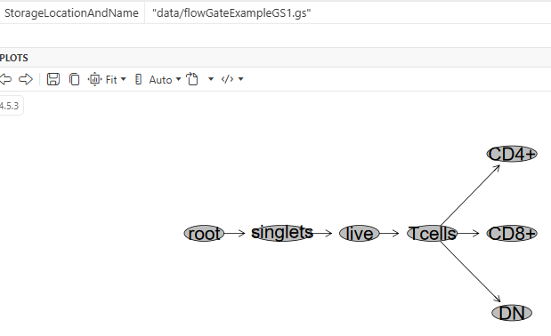

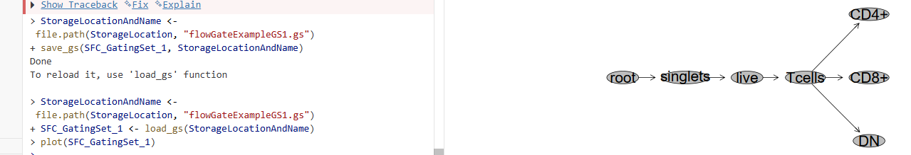

# Misdrawn vs Corrected TNFa vs IFNg quadrant gate

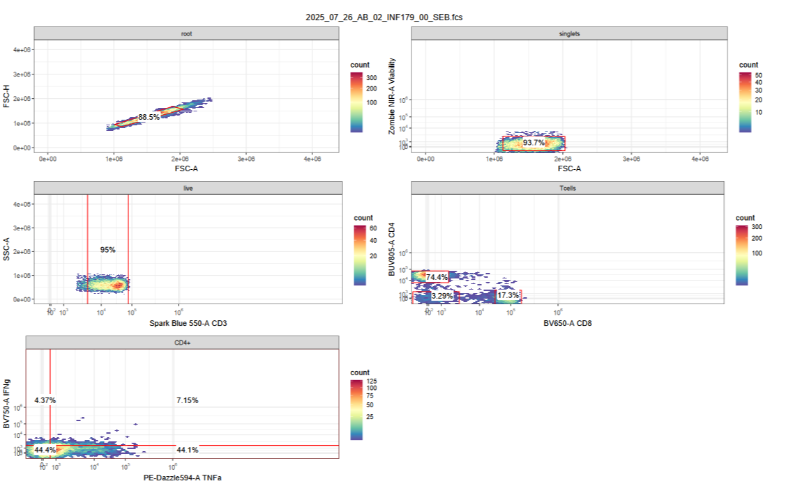

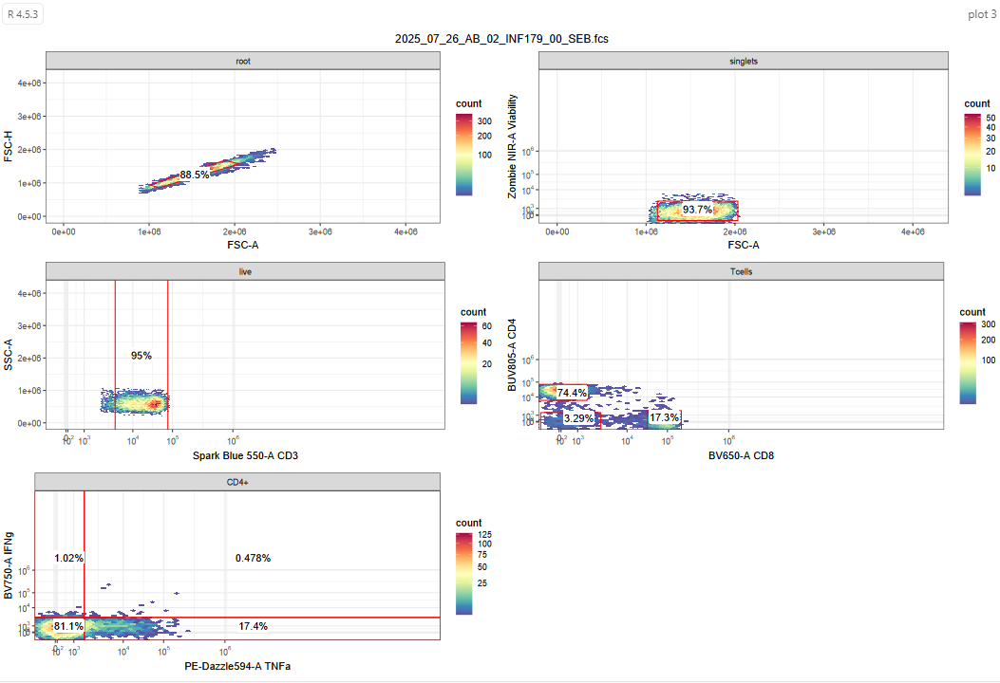

# Error with regate () function

When I tried to use the regate () function, I kept getting an error that the cytokines gate didn't exist. My workaround was to restart Positron and then I could re-run the code to re-draw the cytokine gate, but I'm sure there is a different way to do this.  Here is the error I saw:

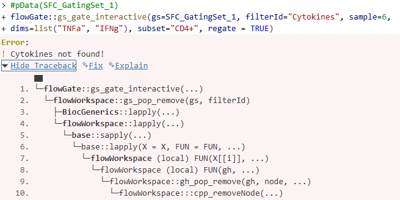

# Problem 2

Go ahead and create your own openCyto gate template, extending to whatever cell target population of interest. Visualize the differences, and ensure that the gates are correctly applied for everyone. Set gate_constaint arguments as needed until everything is just right.

If you do plan to switch over to R for gating long-term, these skillsets will be essential, as you will need to be confident in your ability to adjust your gates as needed.

# Answer 2

T cell gate before adjustments
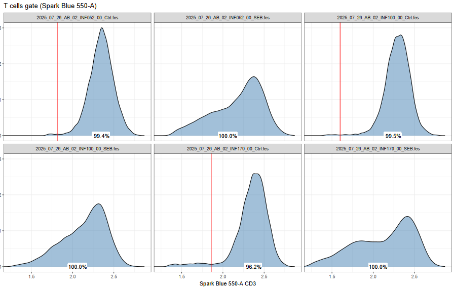

T cell gate after adjustments
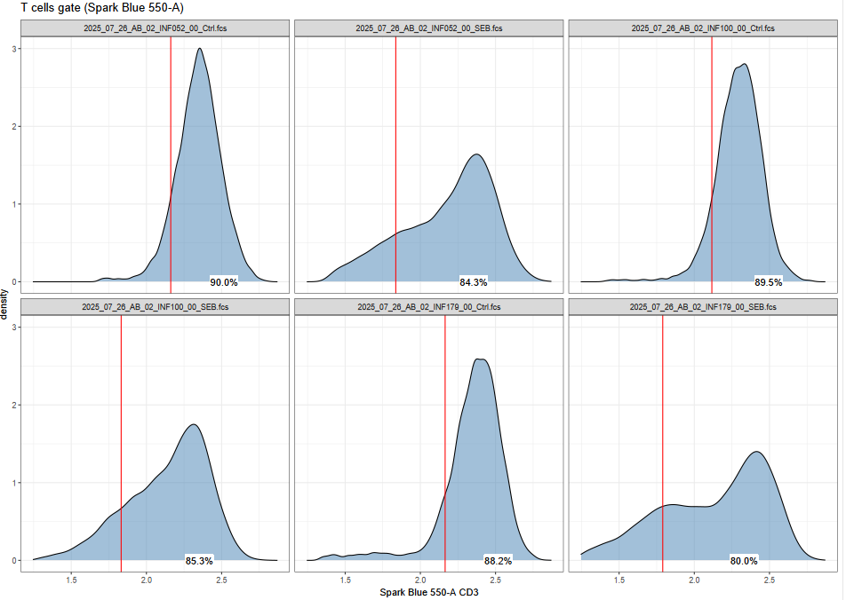

Code to adjust T cell gates
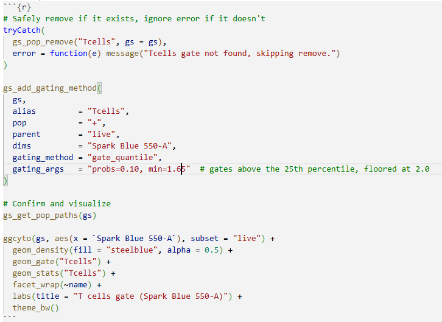

# Problem 3

Re-run your openCyto template, but then add a few additional flowGate on to to extend it further. Save the gating set, close out of positron, and successfully reload.

# Answer 3

# Updates to openCyto template

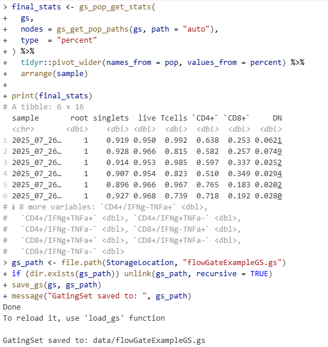

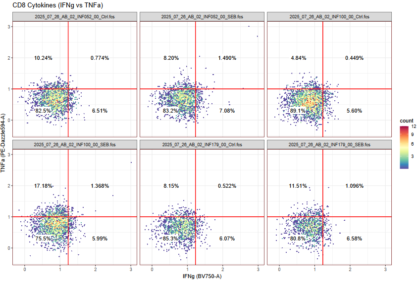

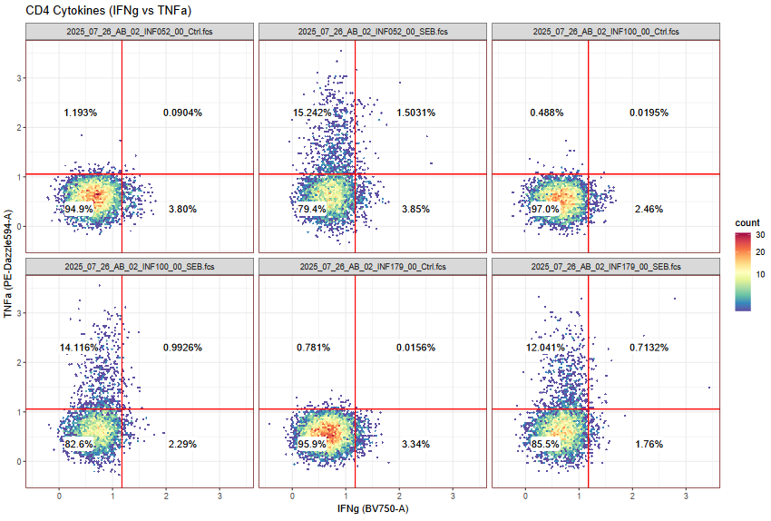

# Reload into Positron

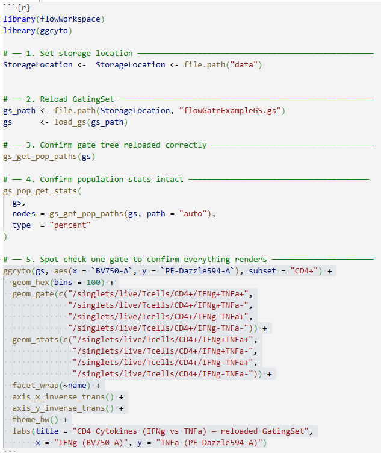

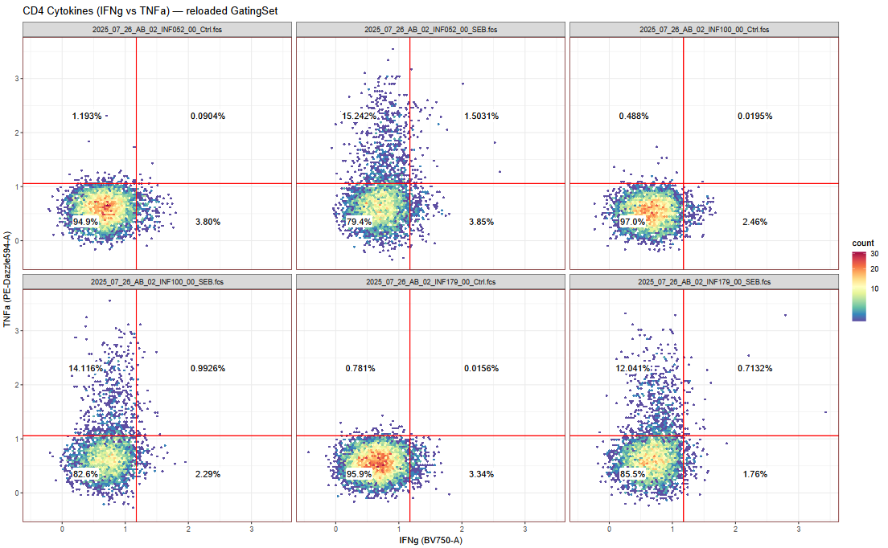
