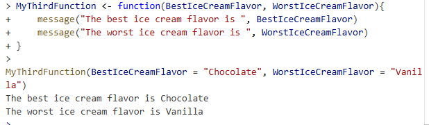
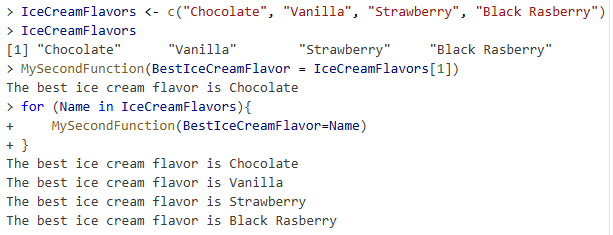
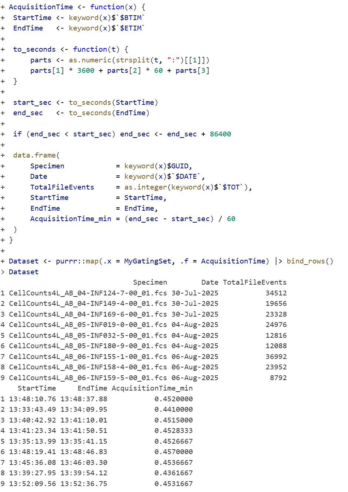
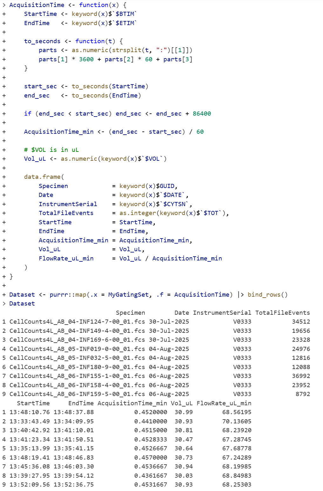

# Problem 1

Modify one of the simpler functions (SecondFunction or similar), provide your own argument names, and modify the message(), paste0 or print() functions to print a text style output. Generate a small vector of values, and iterate through your vector using one of the approaches we used.

# Answer 1

# Problem 2

Using the initial framework for the CellConcentration function, retrieve several other keywords that are of interest, and incorporate them into the returned data.frame row.

# Answer 2

I calculated the total acquisition time in minutes, although I used Claude AI to help work through some of this code.

# Problem 3

For CellConcentration, we retrieved both start and end time. Look up information on lubridate package, convert these times to a time-style format, and from acquired volume derive uL/min at which each .fcs file was acquired. Did this vary at all across days?

The acquisition time was very consistent across all days.

