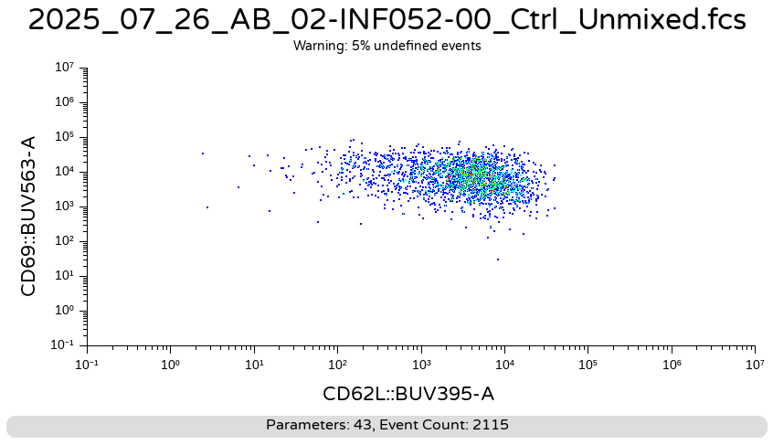

```{r}
#| label: setup
library(tibble)
library(purrr)
library(dplyr)
library(stringr)
library(ggcyto)
library(flowGate)
library(flowWorkspace)
library(magrittr)

data_path <- file.path("data")
```

# Problem 1

> Load a dataset into R, gate it however you like, and then export out a population of interest as their own .fcs files. Open them in either Floreada.io or the commercial software of your choice, and take a screenshot of how they look by two markers of interest.

```{r}
fcs_files <- list.files(data_path, pattern=".fcs", full.names=TRUE)
fcs_files
```

```{r}
gating_set <- fcs_files %>%
  load_cytoset_from_fcs(truncate_max_range = FALSE, transformation = FALSE) %>%
  GatingSet()
gating_set
```

```{r}
SFC_Parameters <- colnames(gating_set)
fluorophores_only <- SFC_Parameters[!stringr::str_detect(SFC_Parameters, "FSC|SSC|Time")]
fluorophores_only
```

Transform data.

```{r}
Biexponential <- flowjo_biexp_trans(channelRange=4096, maxValue=262144,
     pos=4.5, neg=2, widthBasis=-500)
MyBiexTransform <- transformerList(fluorophores_only, Biexponential)
transform(gating_set, MyBiexTransform)
```

```{r}
gating_set[[1]]
```

```{r}
gating_table <- tibble::tribble(
  ~filterId,    ~dims,                          ~subset,      
  "singlets",   list("FSC-A", "FSC-H"),          "root",      
  "live",       list("FSC-A", "Zombie NIR-A"),   "singlets",  
  "Tcells",     list("CD3", "CD45"),             "live",     
  "CD4+",       list("CD8", "CD4"),              "Tcells",   
  "CD8+",       list("CD8", "CD4"),              "Tcells",   
  "DN",         list("CD8", "CD4"),              "Tcells",  
)
```

```{r}
filename <- file.path(data_path, "my_gates.gs")
if (! file.exists(filename)) {
  flowGate::gs_apply_gating_strategy(gating_set, gating_strategy = gating_table)
  save_gs(gating_set, filename)
} else {
  gating_set <- load_gs(filename)
}
```

```{r}
class(gating_set)        # GatingSet
class(gating_set[1])     # GatingSet
class(gating_set[[2]])   # GatingHierarchy
```

```{r}
plot(gating_set)
```


```{r}
#' This function selects a subpopulation and save the result
#' to a file whose name is obtained by appending the subset name
#' to the original filename.
#' 
#' @param x A GatingHierarchy object
#' @param subset A string that names the gate from which
#' to retrieve cell counts from 
#' @param folder A file.path to the folder you want to store the new downsampled
#' fcs file to.
#' @importFrom flowWorkspace gs_pop_get_data
#' @importFrom flowCore parameters keyword write.FCS
#' @importFrom Biobase exprs
#' @importFrom stringr str_replace
#' @returns An FCS object restricted to the subset
subset_population <- function(x, subset, folder){
  #print(class(x))
  inverse.transform = TRUE
  events <- flowWorkspace::gs_pop_get_data(x, subset, inverse.transform=inverse.transform)
  flow_frame <- events[[1, returnType = "flowFrame"]]
  data <- Biobase::exprs(flow_frame)
  OriginalParameters <- flowCore::parameters(flow_frame)
  OriginalDescription <- flowCore::keyword(flow_frame)

  original_name <- OriginalDescription$`GUID`
  updated_suffix <- sprintf("_subset_%s.fcs", subset)
  UpdatedGUID <- stringr::str_replace(original_name, ".fcs", updated_suffix)
  OriginalDescription$`GUID` <- UpdatedGUID

  filename <- file.path(folder, UpdatedGUID)
  print(filename)
  NewFCS <- new("flowFrame", exprs=data, parameters=OriginalParameters, 
        description=OriginalDescription)
  flowCore::write.FCS(NewFCS, filename = filename, delimiter="#")
  NewFCS
}
```


```{r}
gating_set %>%
  walk(\(x) subset_population(x, "CD8+", data_path))
```


Screenshot from Floreada.io




# Problem 2

> In the example for Downsampling() we only changed one keyword (GUID), after substituting in our desired addon right before the .fcs. Since keyword use might vary by manufacturer, create a couple additional arguments for Downsampling() that allow you to change out the values for some additional keywords.

In this version of the Downsampling function the new FCS name will be
stored to every keyword in the fileKeywords parameter.

```{r}
#' This function downsamples from a designated gate to our desired number
#' of cells, returning as a new .fcs file
#' 
#' @param x A GatingSet object, typically iterated in.
#' @param subset The gate from which to retrieve cell counts from 
#' @param inverse.transform Whether to revert values back to their
#' original untransformed values before export as an .fcs file, default
#' is set to TRUE
#' @param DownsampleCount The desired number of cells to downsample from
#' each gated population. If value is less than 1, subsets out the 
#' equivalent proportion from that specimen
#' @param addon An additional character value to add before .fcs in the GUID
#' keyword to tell the downsampled file apart from the original. 
#' @param fileKeywords A character vector of additional keywords to set with the new
#' filename in addition to "GUID"
#' @param StorageLocation A file.path to the folder you want to store the new downsampled
#' fcs file to. Default NULL results in .fcs file being stored in current working directory
#' @param returnType Whether to return as a "fcs" file (default), or "flowFrame" or "data.frame"
#' 
#' @importFrom flowWorkspace gs_pop_get_data
#' @importFrom flowCore parameters keyword write.FCS
#' @importFrom Biobase exprs
#' @importFrom dplyr slice_sample
#'  
#' 
Downsampling <- function(x, subset, inverse.transform=TRUE, DownsampleCount,
  addon, fileKeywords = NULL, StorageLocation=NULL, returnType="fcs"){
  EventsInTheGate <- flowWorkspace::gs_pop_get_data(x, subset,
   inverse.transform=inverse.transform)
  MeasurementData <- Biobase::exprs(EventsInTheGate[[1]])
  MeasurementDataFramed <- as.data.frame(MeasurementData, check.names = FALSE)

  if (DownsampleCount < 1) {
      Count <- nrow(EventsInTheGate) # Original Count
      Count <- as.numeric(Count) #Sanity Check on Value Type
      Count <- Count*DownsampleCount # Target Cells
      Count <- round(Count, 0)
      DownsampleCount <- Count # Over-writting DownsampleCount used for downsampling
    }

  Downsampled_DataFrame <- dplyr::slice_sample(MeasurementDataFramed, n = DownsampleCount, replace = FALSE)

  DownsampledMatrix <- as.matrix(Downsampled_DataFrame)

  flowFrame <- EventsInTheGate[[1, returnType = "flowFrame"]]
  OriginalParameters <- flowCore::parameters(flowFrame)
  OriginalDescription <- flowCore::keyword(flowFrame)

  rename_helper <- function(value, addon) {
    new_suffix <- paste0("_", addon, ".fcs")
    new_value <- str_replace(value, ".fcs", new_suffix)
    new_value
  }
  UpdatedGUID <- rename_helper(OriginalDescription$`GUID`, addon)
  OriginalDescription$`GUID` <- UpdatedGUID
 
  # Optionally change other "name" keywords
  for (kw in fileKeywords) {
    OriginalDescription[kw] <- rename_helper(OriginalDescription[kw], addon)
  }

  NewFCS <- new("flowFrame", exprs=DownsampledMatrix, parameters=OriginalParameters, description=OriginalDescription)

  if (is.null(StorageLocation)){StorageLocation <- getwd()}

  StoreFCSFileHere <- file.path(StorageLocation, UpdatedGUID)
  
  if (returnType == "fcs"){
    flowCore::write.FCS(NewFCS, filename = StoreFCSFileHere, delimiter="#") # Write out .fcs file
  } else if (returnType == "data.frame"){
    return(Downsampled_DataFrame) #Return data.frame without metadata
  } else {
    return(NewFCS) #All other criterias return a flowFrame with metadata
    }

}
```

Try it out.

```{r}
gating_set[1] %>%
  purrr::map(\(x) Downsampling(x, subset="CD8+", DownsampleCount=2500, addon="CD8_kw",
    fileKeywords = c("$FIL", "FILENAME", "ORIGINALGUID"),
    returnType="fcs")
  )
```


# Problem 3

> Trickier - After concatenating out an .fcs file for a cell subset of your choice, reload it back into R, extract out both the exprs matrix, and the description list. Using the keywords that got added, figure out a way using dplyr to revert the numeric keys (denoted by “_key”) in the exprs matrix back to their original character values as recorded in the keywords.


```{r}
source("concatenate.R")
```

```{r}
filename <- file.path(data_path, "my_gates.gs")
gating_set <- load_gs(filename)
```

```{r}
CurrentMetadata <- pData(gating_set)
CurrentMetadata
```

```{r}
TheCSV <- list.files(data_path, pattern=".csv", full.names=TRUE)
AdditionalMetadata <- read.csv(TheCSV, check.names=FALSE)
colnames(CurrentMetadata)
```

```{r}
UpdatedMetadata <- left_join(CurrentMetadata, AdditionalMetadata, by="name")
rownames(UpdatedMetadata) <- UpdatedMetadata$name
pData(gating_set) <- UpdatedMetadata
pData(gating_set)
```

```{r}
Concatenate(gs=gating_set, subset="CD4+", addon="CD4", DownsampleCount=2000,
  desiredCols=c("name", "condition", "infant_sex", "HEU_status"), returnType="fcs")
```

```{r}
filename <- "MyConcatenatedFCS.fcs"
fcs <- read.FCS(filename)
```


```{r}
fcs
```


```{r}
e <- exprs(fcs)
description <- flowCore::keyword(fcs)
```

Extract contents of every keyword whose name ends with _Key.

```{r}
description %>% keep_at(\(x) str_detect(x, "_Key$"))
```

```{r}
description$condition
```

We will change these columns.

```{r}
columns <- colnames(UpdatedMetadata)
columns
```

Convert the four columns. The conversions are done using named vectors.
Also prints the named vector used for each column.

```{r}
df <- as_tibble(e)
my_split <- function(key) str_split_1(unname(description[[key]]), " ")
for (c in columns) {
  cat(sprintf("\nColumn: %s\n", c))
  new_values <- my_split(c)                 # a character vector
  old_values <- my_split(paste0(c, "_Key")) # a double vector
  conv <- new_values %>% set_names(old_values)  # the named vector used for conversion
  print(conv)
  df[, c] <- unname(conv[as.character(df[[c]])])   # Do the conversion
}
```

Distribution of the original numeric columns.

```{r}
as_tibble(e) %>% 
  select(all_of(columns)) %>% 
  mutate(across(everything(), as.factor)) %>% 
  summary()
```


Distribution of the converted character columns.

```{r}
df %>% 
  select(all_of(columns)) %>%
  mutate(across(everything(), as.factor)) %>% 
  summary()
```

```{r}
df %>% 
  select(all_of(columns)) %>% 
  head()
```

Looks correct.