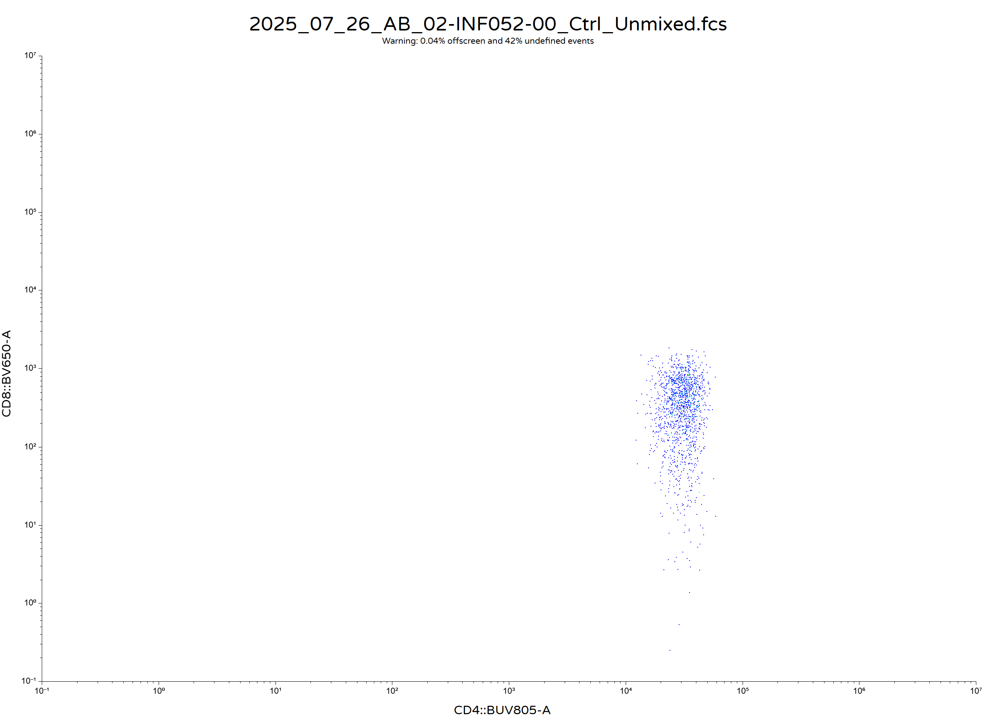
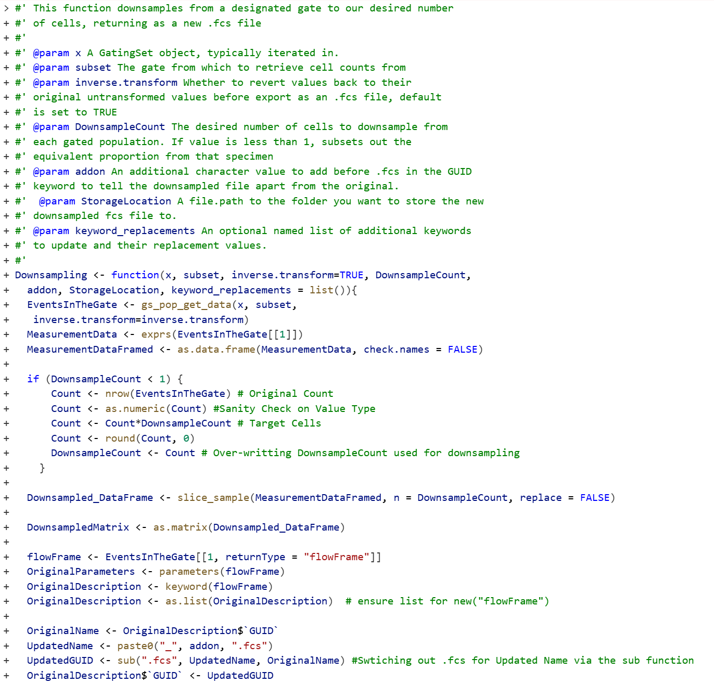
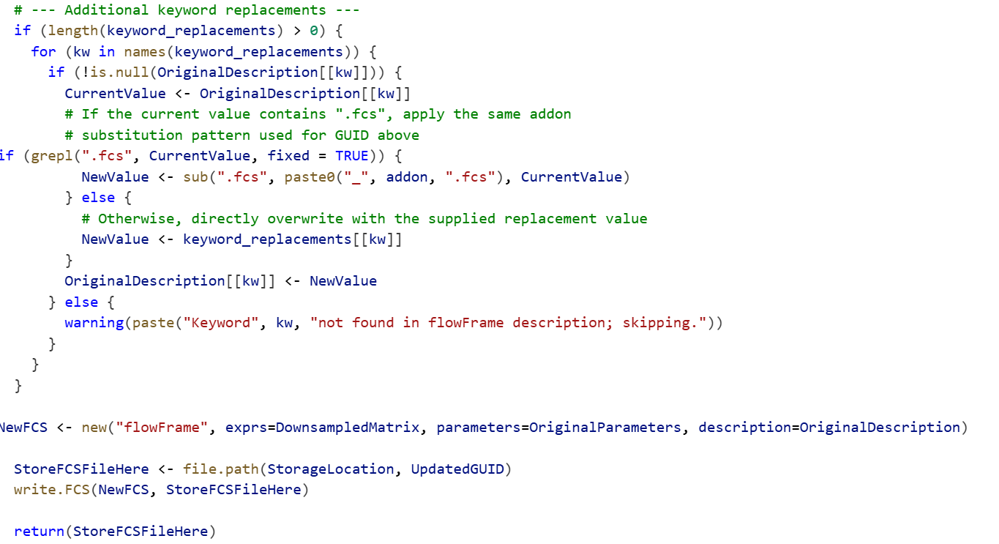
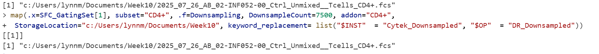
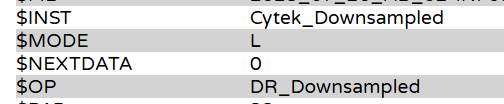
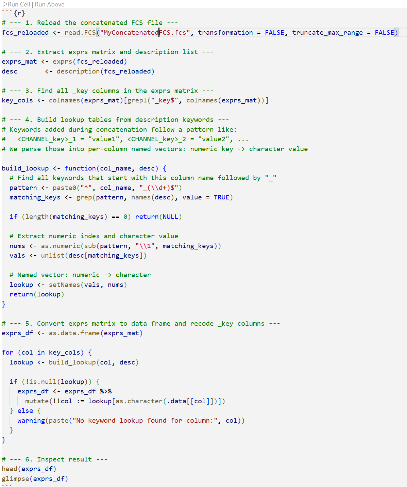
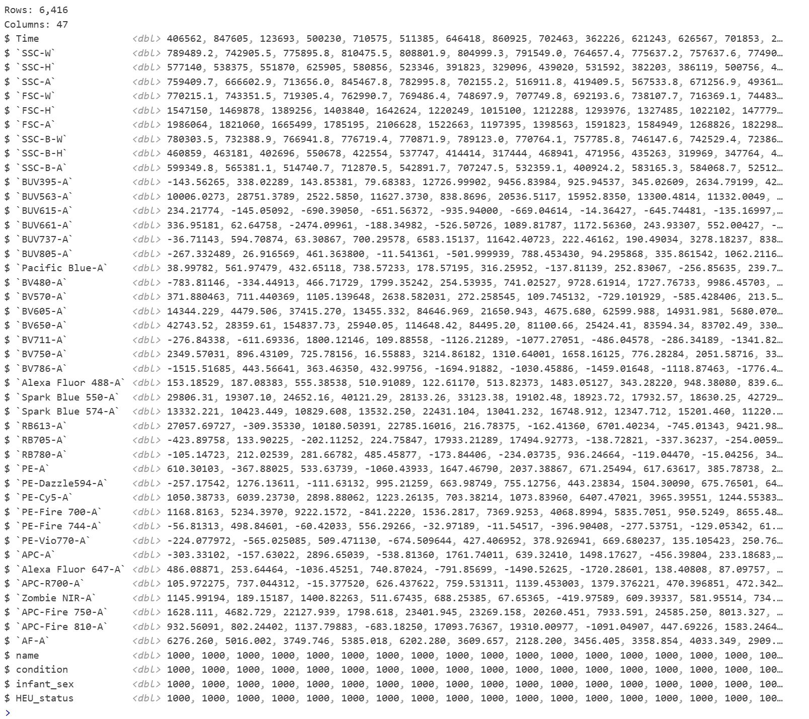

# Problem 1

Load a dataset into R, gate it however you like, and then export out a population of interest as their own .fcs files. Open them in either Floreada.io or the commercial software of your choice, and take a screenshot of how they look by two markers of interest.

# Answer 1

# Problem 2

In the example for Downsampling() we only changed one keyword (GUID), after substituting in our desired addon right before the .fcs. Since keyword use might vary by manufacturer, create a couple additional arguments for Downsampling() that allow you to change out the values for some additional keywords.

# Answer 2

# Problem 3

Trickier - After concatenating out an .fcs file for a cell subset of your choice, reload it back into R, extract out both the exprs matrix, and the description list. Using the keywords that got added, figure out a way using dplyr to revert the numeric keys (denoted by “_key”) in the exprs matrix back to their original character values as recorded in the keywords.

# Answer 3

