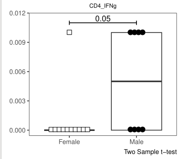

```{r}
#| label: setup
library(tibble)
library(purrr)
library(dplyr)
library(stringr)
library(ggcyto)
library(flowGate)
library(flowWorkspace)
library(magrittr)
library(openCyto)
library(tidyr)
library(fBasics)    # For dagotest
library(broom)

source("original_functions.R")

data_path <- file.path("data")
result_path <- file.path("results")
```

# Problem 1

> Implement additional openCyto gates, and validate that they are being placed correctly using Utility_GatingPlot(). Update the gate_range arguments until satisfied. Then, add new gates, and run the resulting dataset through CombinedFlow(), screenshotting any values that return with p-values that upon visualizing the data also look reasonable (not driven by a single-outlier).


```{r}
# remotes::install_github("DavidRach/Luciernaga")
library(Luciernaga)
```

```{r}
#| label: Load FCS files
StorageLocation <- file.path("data") # For Quarto Rendering
# StorageLocation <- file.path("course", "11_DataForStats", "data")

OutputFolder <- file.path("data") # For Quarto Rendering
# OutputFolder <- file.path("course", "11_DataForStats", "outputs")

fcs_files <- list.files(StorageLocation, pattern=".fcs", full.names=TRUE)

SFC_cytoset <- load_cytoset_from_fcs(fcs_files, truncate_max_range=FALSE, transformation=FALSE)
SFC_GatingSet <- GatingSet(SFC_cytoset)
SFC_GatingSet
```

```{r}
#| label: Transform fluorophores
SFC_Parameters <- colnames(SFC_GatingSet)
FluorophoresOnly <- SFC_Parameters[!stringr::str_detect(SFC_Parameters, "FSC|SSC|Time")]

Biexponential <- flowjo_biexp_trans(channelRange=4096, maxValue=262144,
     pos=4.5, neg=2, widthBasis=-750)
MyBiexTransform <- transformerList(FluorophoresOnly, Biexponential)
transform(SFC_GatingSet, MyBiexTransform)
```

```{r}
CurrentMetadata <- pData(SFC_GatingSet)
CurrentMetadata <- CurrentMetadata |> mutate(specimen = name) |>
     mutate(specimen = stringr::str_extract(specimen, "INF\\d+")) |>
     mutate(specimen = stringr::str_replace(specimen, "INF0(\\d{3})", "INF\\1"))

TheCSV <- list.files(StorageLocation, pattern="Metadata.csv", full.names=TRUE)
AdditionalMetadata <- read.csv(TheCSV, check.names=FALSE)
AdditionalMetadata <- AdditionalMetadata|>
     mutate(specimen = stringr::str_replace(specimen, "INF0(\\d{3})", "INF\\1"))
```

```{r}
UpdatedMetadata <- left_join(CurrentMetadata, AdditionalMetadata, by="specimen")
rownames(UpdatedMetadata) <- UpdatedMetadata$name
pData(SFC_GatingSet) <- UpdatedMetadata
pData(SFC_GatingSet)
```

```{r}
OurGateTemplate <- list.files(StorageLocation, pattern="GatesUnmixed.csv", full.names=TRUE)
Example <- read.csv(OurGateTemplate, check.names=FALSE)
Example
```

pop = +/- means create both populations. Alias then has to be an asterisk.

https://www.bioconductor.org/packages//release/bioc/vignettes/openCyto/inst/doc/HowToWriteCSVTemplate.html

What markers we have available?

```{r}
markernames(SFC_cytoset[[1]]) %>% unname()
```

```{r}
# install.packages("data.table") # CRAN
GatesToApply <- data.table::fread(OurGateTemplate)
```

Add one more gate to the dataframe.

```{r}
row <- data.frame(alias="Tcells_CD27", pop="+", parent = "Tcells", dims="CD27", gating_method="gate_mindensity",
  gating_args="gate_range=c(2900,3000)", collapseDataForGating=FALSE)
GatesToApply <- GatesToApply %>% bind_rows(row)
TheFullTemplate <- gatingTemplate(GatesToApply)
```

Do the gating.

```{r}
#| label: Perform gating
gt_gating(TheFullTemplate, SFC_GatingSet)
```

Check the plots.

```{r}
#| label: Utility_GatingPlots results
IndividualPlot <- Luciernaga::Utility_GatingPlots(x=SFC_GatingSet[[1]],
 sample.name = "GUID", removestrings = ".fcs", gtFile = GatesToApply, returnType="patchwork")
IndividualPlot
```

Looks great.


Add one more gate, now using a different method.

```{r}
gs_add_gating_method(SFC_GatingSet, 
                     pop="+",
                     parent = "Tcells", 
                     dims = "CCR7",
                     alias = "Tcells_CCR7", 
                     gating_method = "gate_mindensity", 
                     gating_args = "gate_range=c(2900, 3000)")
```

```{r}
Data <- gs_pop_get_count_with_meta(SFC_GatingSet, "freq")
```

```{r}
Data %>% head()
```

```{r}
# colnames(Data)
Data$Population <- basename(Data$Population)
Data$Frequency <- round(Data$Frequency, 2)

RemoveTheseColumns <- c("Parent", "ParentFrequency", "name", "sampleName")

Data <- Data |> select(!tidyselect::any_of(RemoveTheseColumns))
Data <- Data |> relocate(specimen, Condition, timepoint, ptype, infant_sex, .before=Population)
```

```{r}
Data <- Data |> pivot_wider(names_from=Population, values_from = Frequency)
```

```{r}
shape_sex <- c("Female" = 22, "Male" = 21)
shape_ptype <- c("HU" = 22, "HEU-lo" = 21, "HEU-hi" = 21)

fill_sex <- c("Female" = "white", "Male" = "black")
fill_ptype <- c("HU" = "white", "HEU-lo" = "darkgray", "HEU-hi" = "black")
```


Try with the newly added gate.


```{r}
#| label: CombinedFlow results
CombinedFlow(data=Data, theColumn="Tcells_CCR7", theFactor="infant_sex",
     shape_palette=shape_sex, fill_palette=fill_sex, parametric = "parametric")
```

Not significant.

Let's check all gates.

```{r}
TheColumns <- colnames(Data[6:ncol(Data)])
plots <- purrr::map(TheColumns, ~ CombinedFlow(theColumn = .x, data=Data, theFactor="infant_sex",
     shape_palette=shape_sex, fill_palette=fill_sex, parametric = "parametric"))
```

Create pdfs.

```{r}
PDF <- Utility_Patchwork(x=plots, thecolumns=2, therows=3, 
     returntype="pdf", outfolder=result_path, filename="AllThePlots")
```

CD4_IFNg population seems to have significant difference between sexes that is not driven
by a single outlier



# Problem 2

> In our ggbeeswarm boxplot, currently we are seeing the proportion on the y-axis. Figure out how to modify the StatPlotsForFlow() function to instead display the axis as a percentage, and then using additional function arguments and conditions, set the function up to allow you to switch between as desired. Also, externalize size and cex to modify your beeswarm boxplots in an easier fashion!


```{r}
Data
```

```{r}
summary(Data)
```

```{r}
#' Generate a beeswarm-boxplot for a given column by a factor column
#' of interest
#' 
#' @param data The data.frame or tibble object containing our dataset
#' @param theColumn The column containing our measurements of interest
#' @param theFactor The column containing our metadata to compare by
#' @param shape_palette R shape values given to scale_shape_manual,
#' should match levels present in theFactor. For example...
#' shape_sex <- c("Female" = 22, "Male" = 21)
#' @param shape_fill R fill values given to scale_fill_manual, 
#' should match levels present in theFactor. For example...
#' fill_sex <- c("Female" = "white", "Male" = "black")
#' @param percentages A logical value telling whether to use percentages on y-axis or not
#' @param cex A numeric value giving the spacing between points. Values between 1 and 3
#' tend to work best.
#' @param size A numeric value gives the size of the points.
#' 
#' @importFrom gggplot2 ggplot aes geom_boxplot scale_shape_manual
#' scale_fill_manual labs theme_bw theme element_blank()
#' @importFrom ggbeeswarm geom_beeswarm element_text
#' 
#' 
StatPlotsForFlow_modified <- function(data, theColumn, theFactor,
     shape_palette, fill_palette, percentages = FALSE,
     cex = 3, size = 3){

     PlotName <- theColumn

     plot <- ggplot(data, aes(x =.data[[theFactor]], y = .data[[theColumn]])) +
          geom_boxplot(show.legend = FALSE) +
          ggbeeswarm::geom_beeswarm(show.legend = FALSE, aes(shape = .data[[theFactor]],
               fill = .data[[theFactor]]), method = "center", side = 0,
               priority = "density", cex = cex, size = size, corral = "wrap",
               corral.width = 3) + 
          scale_shape_manual(values = shape_palette) +
          scale_fill_manual(values = fill_palette) +
          ( if (percentages) scale_y_continuous(labels = scales::label_percent()) ) +
          labs(title = PlotName, x = NULL, y = NULL) +
          theme_bw() + 
          theme(panel.grid.major = element_blank(),
               panel.grid.minor = element_blank(),
               plot.title = element_text(hjust = 0.5, size = 8)
               )
     return(plot)
}
```

```{r}
shape_sex <- c("Female" = 22, "Male" = 21)
shape_ptype <- c("HU" = 22, "HEU-lo" = 21, "HEU-hi" = 21)

fill_sex <- c("Female" = "white", "Male" = "black")
fill_ptype <- c("HU" = "white", "HEU-lo" = "darkgray", "HEU-hi" = "black")
```

```{r}
StatPlotsForFlow_modified(data=Data, theColumn="CD4+", theFactor="infant_sex", 
     shape_palette=shape_sex, fill_palette=fill_sex, percentages = TRUE,
     cex = 2.5, size = 10)
```

# Problem 3

> Some “typical” immunology workflows run a “normality” test before implementing a corresponding downstream test based on the result (Your friendly-neighbourhood statistician may have some strong thoughts on this field practice). Regardless of your position on this approach, see if you can modify our StatsFromFlow() function, using additional arguments conditional statements, to incorporate in a shapiro-wilks or fBasics package Omnibus K2 test first, and based on the outputs proceed downstream to either the parametric or non-parametric options

```{r}
#' Helper function that wraps the various statistical test to
#' enable quick statistical outputs for our extracted data
#' 
#' A normality test is used for deciding whether to use parametric or non-parametric test.
#' 
#' @param data The data.frame or tibble object containing our dataset
#' @param theColumn The column containing our measurements of interest
#' @param theFactor The column containing our metadata to compare by
#######' @param parametric Whether to use parametric or non-parametric test
#' @param test A character string either 'dagostino' or 'shapiro_wilk' gives the method
#' used to perform normality test.
#' @param alpha Default set to 0.05
#' @param correction Method for FDR correction, default is "none"
#' @param debug A logical value telling whether to print debug output
#' 
StatsFromFlow_modified <- function(data, theColumn, theFactor, 
#parametric,
     test = "dagostino",
     alpha=0.05, correction="none", debug = FALSE){

     myprint <- function(s) { if (debug) cat(s)}

     #theColumn <- x
     GateName <- theColumn
     FactorName <- theFactor

     FactorLevels <- data[[theFactor]] |> unique() |> length()

     if (test == "dagostino") {
          test_function <- fBasics::dagoTest  # D'Agostino-Pearson K² test
          myprint("Testing normality using D'Agostino's test\n")
     } else if (test == "shapiro_wilk") {
          test_function <- stats::shapiro.test
          myprint("Testing normality using Shapiro-Wilk's test\n")
     } else {
          stop("Unknow test:", test)
     }

     # Boolean variable telling whether all variables are normally distributed
     non_normal <- data %>% 
          group_by(across(all_of(theFactor))) %>% 
          # Both test functions return an object of class "htest"
          summarise(p_value = test_function(.data[[theColumn]]) %>% pluck("p.value")) %>%
          mutate(significant = p_value < alpha) %>%
          (\(x) if (debug) print(x) else x ) %>%
          pull(significant) %>%
          any()
     parametric <- if (non_normal) "non-parametric" else "parametric"
     sprintf("Performing %s test on variables %s with %i levels\n", parametric, theColumn, FactorLevels) %>% myprint()

     if (parametric=="parametric" && FactorLevels == 2){

          myprint("parametric with 2-levels\n")
          Results <- tidy(t.test(data[[theColumn]] ~ data[[theFactor]],
          alternative = "two.sided", var.equal = TRUE))

     } else if (parametric=="non-parametric" && FactorLevels == 2){

          myprint("non-parametric with 2-levels\n")
          Results <- tidy(wilcox.test(data[[theColumn]] ~ data[[theFactor]],
          alternative = "two.sided", exact=FALSE))

     } else if (parametric=="parametric" && FactorLevels == 3){
          myprint("parametric with 3-levels\n")
          Results <- tidy(aov(data[[theColumn]] ~ data[[theFactor]], data = data))
          Results <- Results[1,]
          Results <- Results |> mutate(method="One-Way Anova")

          if (!is.na(Results$p.value) && Results$p.value <= alpha){
               Pairwise <- tidy(pairwise.t.test(data[[theColumn]], data[[theFactor]],
                                   p.adjust.method = correction))
               Pairwise$method <- "Pairwise t-test"
               Results <- Pairwise
          } 

     } else if (parametric=="non-parametric" && FactorLevels == 3){
          myprint("non-parametric with 3-levels\n")
          Results <- tidy(kruskal.test(data[[theColumn]] ~ data[[theFactor]], data = data))

          if (!is.na(Results$p.value) && Results$p.value <= alpha){
               Pairwise <- tidy(pairwise.wilcox.test(data[[theColumn]], g=data[[theFactor]],
               p.adjust.method = correction, exact=FALSE))
               Pairwise$method <- "Pairwise Wilcox test"
               Results <- Pairwise 
          }

     } else (stop("Sorry, we didn't plan for your use case"))

     Results <- Results |> mutate(GateName=GateName) |> mutate(FactorName=FactorName)
     return(Results)
}
```

```{r}
colnames(Data)
```

```{r}
Data %>% count(ptype)
```

```{r}
TheseColumns <- colnames(Data)[6:9]               # 6:ncol(Data)
TheseColumns %>% 
     purrr::map(\(column) StatsFromFlow_modified(
          data=Data, theColumn=column,
          #theFactor="ptype",
          theFactor = "infant_sex", 
          test = "shapiro_wilk",    # too little data for D'Agostino's test
          alpha=0.05, debug = TRUE)
          ) %>% 
     bind_rows()
```