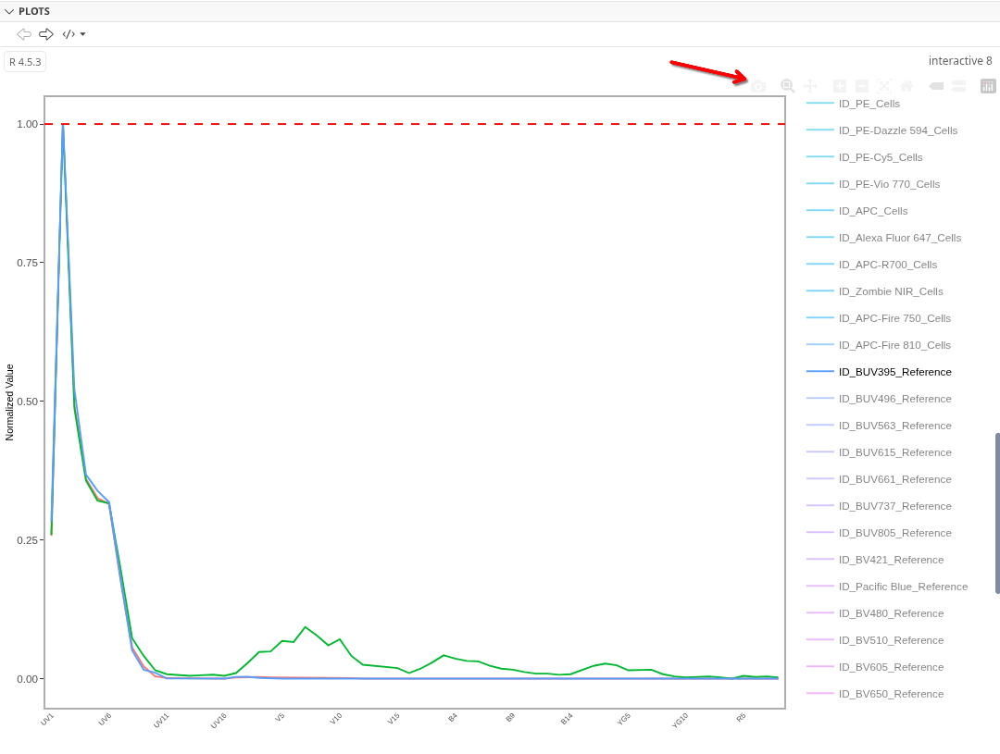
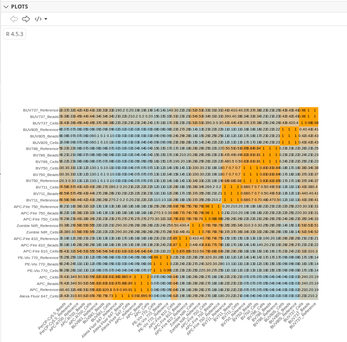

::: {style="text-align: right;"}
[](https://www.gnu.org/licenses/agpl-3.0.en.html) [](http://creativecommons.org/licenses/by-sa/4.0/)
:::

For the YouTube livestream schedule, see [here](https://www.youtube.com/@cytometryinr)

For screen-shot slides, click [here](/course/03_InsideFCSFile/slides.qmd)

<br>

---

# Background

Welcome to [Week 13](/Schedule.qmd#similarities-and-hotspots) of the course. Over the past two weeks, we have seen how to [isolate]() normalized fluorescent signatures from our unmixing controls. We also explored ways to [make this process]() more feasible (and less painful) to implement when working with all the fluorophores in our panel.

The focus of today's walkthrough will be to explore the various ways by which we can compare these signatures to each other, and how to infer additional context about how our proposed fluorophore panels will perform when we factor in the regions of signature overlap that are present between the fluorophores. This in turn can lead to better future panel designs (as we try to reduce the extent of the overlap to improve resolution)

By the end of this primary walkthrough (and the bonus content), you will also hopefully have a better understanding about what goes into the various panel metrics displayed by various commercial vendors.

# Walk Through

## Set Up

As always, lets start by loading to our local environment any R packages that we are likely to need today. 

```{r}
library(dplyr)
library(purrr)
library(stringr)
library(ggplot2)
library(Luciernaga)
library(tidyr)
library(tibble)
```

We will start first working with the signature matrices for the bead and cell single-color controls from the [SDY3080]() dataset that we completed retrieving as part of the bonus [Signature Matrices]() walk-through. These were saved as .csv files that can be found in this week's data folder. 

```{r}
#StorageLocation <- file.path("course", "13_SpectralSimilarities", "data")
StorageLocation <- file.path("data")

#OutputLocation <- file.path("course", "13_SpectralSimilarities", "outputs")
OutputLocation <- file.path("outputs")
```

Lets go ahead and load the signature matrix that we derived from the bead single-color controls. 

```{r}
BeadsPath <- list.files(StorageLocation, pattern="BeadInitialSignature", full.names=TRUE)
BeadData <- read.csv(BeadsPath, check.names=FALSE)
BeadData <- BeadData |> filter(!str_detect(Fluorophore, "Unstained"))
head(BeadData, 3)
```

And same process for the signature matrix retrieved from the cell-single color controls. 

```{r}
CellsPath <- list.files(StorageLocation, pattern="CellInitialSignature", full.names=TRUE)
CellsData <- read.csv(CellsPath, check.names=FALSE)
CellsData <- CellsData |> filter(!str_detect(Fluorophore, "Unstained"))
head(CellsData, 3)
```

Additionally, lets retrieve the reference signatures we have been comparing from `Luciernaga()` for easier comparison vs. those we ourselves derived. 

```{r}
OurFluorophores <- CellsData |> pull(Fluorophore)

Data <- Luciernaga:::InstrumentReferences(64) |> filter(Fluorophore %in% OurFluorophores) 

ReferenceData <- Data |> select(-Instrument) |>
      tidyr::pivot_wider(names_from="Detector", values_from="AdjustedY")

head(ReferenceData, 3)
```

### Rearranging by Detector

To make our lives a little bit easier, lets rearrange the rows so that we see the fluorophores displayed by peak detector according to laser. We can first modify the tidying code on the `Luciernaga` references to determine peak detectors for each fluorophore. 

```{r}
# Determine Peak Detectors for rearranging later
PeakDetectors <- Data |> group_by(Fluorophore) |>
      arrange(desc(AdjustedY)) |> slice(1) |> ungroup() |>
      select(!c(Instrument, AdjustedY))

PeakDetectors
```

We then need to relocate our previously written code containing the instrument detector (to avoid re-typing the vector of detector names in correct sequence by hand again).

```{r}
DetectorOrder <- c("UV1", "UV2", "UV3", "UV4", "UV5", "UV6", "UV7", "UV8",
               "UV9", "UV10", "UV11", "UV12", "UV13", "UV14", "UV15", "UV16",
               "V1", "V2", "V3", "V4", "V5", "V6", "V7", "V8",
               "V9", "V10", "V11","V12", "V13", "V14", "V15", "V16",
               "B1", "B2", "B3", "B4", "B5", "B6", "B7", "B8",
               "B9", "B10", "B11", "B12", "B13", "B14",
               "YG1", "YG2", "YG3", "YG4", "YG5", "YG6", "YG7", "YG8", "YG9", "YG10",
               "R1", "R2", "R3", "R4", "R5", "R6", "R7", "R8")
```

Now that we have the vector with the correct sequence, we can `factor()` the peak detectors data.frame, and `rearrange()` it into the correct order. From there, we can `pull()` the Fluorophore column to retrieve a vector of Fluorophore names in the correct sequence.  

```{r}
PeakDetectors$Detector <- factor(PeakDetectors$Detector, levels=DetectorOrder)

FluorophoreOrder <- PeakDetectors |> arrange(Detector) |>
     unique() |> pull(Fluorophore)

FluorophoreOrder
```

At this point, we just need to rearrange our existing data.frame objects to match. 

```{r}
BeadData$Fluorophore <- factor(BeadData$Fluorophore, levels=FluorophoreOrder)
BeadData <- BeadData |> arrange(Fluorophore)
head(BeadData,3)
```

```{r}
CellsData$Fluorophore <- factor(CellsData$Fluorophore, levels=FluorophoreOrder)
CellsData <- CellsData |> arrange(Fluorophore)
head(CellsData,3)
```

```{r}
ReferenceData$Fluorophore <- factor(ReferenceData$Fluorophore, levels=FluorophoreOrder)
ReferenceData <- ReferenceData |> arrange(Fluorophore)
head(ReferenceData,3)
```

## Panel 

Before going to far, lets refresh our memory for this Cytek Aurora 5-laser panel of how these fluorophores are distributed across the various lasers and wavelengths. 

```{r}
TableData <- CellsData |> select(Fluorophore, Antigen) |> mutate(Day=1)
rownames(TableData) <- NULL
Table <- FluorophoreMatrix(TableData, NumberDetectors = 64)
```

```{r}
Table
```

When considering whether certain combinations of fluorophores will behave together, its is important to remember that fluorophores can interact **intra-laser** (on adjacent fluorophores), **inter-laser** (on fluorophores with similar wavelength emissions for other lasers), and **tandem** interactions (especially for tandem degradation scenarios). 

The extent that these interactions affect your panel can be partially mediated depending on the co-expression pattern of your cell populations for the respective antigens. 

## Signatures

Let's go ahead and use `VisualizeSignatures()` to see our retrieved signatures

```{r}
BeadData2 <- BeadData |>
      select(-c("name", "Antigen", "Type", "Detector", "Negative"))

Plots <- VisualizeSignatures(data=BeadData2,
 columnname="Fluorophore", Normalize = FALSE)

plotly::ggplotly(Plots)
```

```{r}
CellsData2 <- CellsData |>
      select(-c("name", "Antigen", "Type", "Detector", "Negative"))

Plots <- VisualizeSignatures(data=CellsData2,
 columnname="Fluorophore", Normalize = FALSE)

plotly::ggplotly(Plots)
```

```{r}
Plots <- VisualizeSignatures(data=ReferenceData,
 columnname="Fluorophore", Normalize = FALSE)

plotly::ggplotly(Plots)
```

### Direct Comparison

Obviously, one way to compare our retrieved signatures is just to place them into the same view. Lets do some of the required tidying first, to avoid accidentally over-writing. We can first append identifyers for each data.frame via `paste0()` to the existing name in the Fluorophore column. Separately, the 'Reference' data.frame has different column names for the detector columns, so we can add the "-A" needed to match to the cell and bead data.frames, allowing us to combine the rows together via `rbind()`

```{r}
BeadData2$Fluorophore <- paste0(BeadData2$Fluorophore, "_Beads")
CellsData2$Fluorophore <- paste0(CellsData2$Fluorophore, "_Cells")
ReferenceData$Fluorophore <- paste0(ReferenceData$Fluorophore, "_Reference")
colnames(ReferenceData)[2:ncol(ReferenceData)] <- paste0(colnames(ReferenceData)[2:ncol(ReferenceData)], "-A")
Dataset <- rbind(BeadData2, CellsData2, ReferenceData)
```

With our Dataset assembled, we can now use `VisualizeSignatures()` and `ggplotly()` to open an interactive view. 

```{r}
Plots <- VisualizeSignatures(data=Dataset,
 columnname="Fluorophore", Normalize = FALSE)

plotly::ggplotly(Plots)
```

One of the nice things about `ggplotly()` is it allows you to export an image of what you are seeing directly, by clicking on the camera icon, and selecting the desired storage location. 



As we start off, we can see that for BUV395, the reference and bead controls are fairly similar, although the cell control appears to have some autofluorescence residuals left over


By contrast, for PerCP-Cy5.5, all three are discordant in their own unique ways. 


While we can see these differences, and can describe how they are different, many of the signature comparison metrics are meant to help simplify/facilitate these types of comparisons. 

## Cosine

For those of you who are Cytek Aurora users, you may be familiar with this screen in SpectroFlo, that displays a "similarity matrix". The values that are present within are meant to describe how similar the two fluorophores are to each other. 


Behind the curtain, these values are just the cosine between the two vectors. If both fluorophore vectors are identical to each other, they will have a value of 1. By contrast, if they are not similar, they will have a value of 0. It is easier to describe this by showing it on a plot. 

```{r}
#| code-fold: FALSE
cos_vals <- c(1, 0)
theta <- acos(cos_vals)

df <- data.frame(
  label = paste0("cos = ", cos_vals),
  angle_deg = round(theta * 180 / pi, 1),
  x = sin(theta),
  y = cos(theta)
)

ggplot(df) +
  geom_segment(aes(x = 0, y = 0, xend = x, yend = y, color = label),
               arrow = arrow(length = unit(0.25, "cm")),
               linewidth = 1) +
  coord_fixed(xlim = c(-0.1, 1), ylim = c(-0.1, 1.1)) +
  geom_hline(yintercept = 0, color = "grey80") +
  geom_vline(xintercept = 0, color = "grey80") +
  labs(x = NULL, y = NULL, color = "Vector",
       title = NULL) +
  theme_bw()
```

So no, the values we see displayed when we assemble a matrix are not a percentage. In actuality, it is fascinating seeing the variation.

```{r}
cos_vals <- c(1, 0.999, 0.99, 0.98, 0.97, 0.96, 0.95, 0.90, 0.8, 0.7, 0.6, 0.5, 0.4, 0.3, 0.2, 0.1)
theta <- acos(cos_vals)

df <- data.frame(
  label = paste0("cos = ", cos_vals),
  angle_deg = round(theta * 180 / pi, 1),
  x = sin(theta),
  y = cos(theta)
)

ggplot(df) +
  geom_segment(aes(x = 0, y = 0, xend = x, yend = y, color = label),
               arrow = arrow(length = unit(0.25, "cm")),
               linewidth = 1) +
  coord_fixed(xlim = c(-0.1, 1), ylim = c(-0.1, 1.1)) +
  geom_hline(yintercept = 0, color = "grey80") +
  geom_vline(xintercept = 0, color = "grey80") +
  labs(x = NULL, y = NULL, color = "Vector",
       title = NULL) +
  theme_bw()
```

### Calculating Cosine

Lets go ahead and actually figure out how to calculate our own cosine values. One thing we will need for this is to install the `lsa` package from the CRAN repository. 

```{r}
#| eval: FALSE
install.packages("lsa")
```

```{r}
library(lsa)
```

With this done, lets start with the simpler of the examples, and go ahead and filter for the BUV395 fluorophores from our Dataset

```{r}
BUV395 <- Dataset |> filter(str_detect(Fluorophore, "BUV395"))
BUV395
```

For `lsa`, we will need to provide a matrix. Consequently, lets separate the character from the numeric columns for now. 

```{r}
Names <- BUV395 |> select(!where(is.numeric))
Numbers <- BUV395 |> select(where(is.numeric))
```

We will next need to transpose (using `t()`) our rows into a columns (similar to a `pivot_longer()` operation)

```{r}
NumbersTransposed <- t(Numbers)
head(NumbersTransposed, 4)
```

We can then remove the rownames (by setting them to NULL), and swap out the colnames for the respective identity values. 

```{r}
TheNames <- Names |> pull(Fluorophore)

rownames(NumbersTransposed) <- NULL
colnames(NumbersTransposed) <- TheNames

head(NumbersTransposed, 4)
```

At this point, we are now ready, lets go ahead and run `cosine()` on our matrix. 

```{r}
CosineValues <- cosine(NumbersTransposed)
CosineValues
```

And for a basic example, we are now done! 

But let's scale up to the level of an entire panel by looking at the signatures we extracted from the bead single-color unmixing controls. 

```{r}
JustBeads <- Dataset |> filter(str_detect(Fluorophore, "_Bead"))
```

And rather than have to rewrite this every time for every matrix, we can assemble a small function to help us out. 

```{r}
#' Takes a data.frame, returns the Cosine Matrix
#' 
#' @param data The data.frame object with a single character column
#' 
CosineCalculation <- function(data){
     Names <- data |> select(!where(is.numeric))
     Numbers <- data |> select(where(is.numeric))
     NumbersTransposed <- t(Numbers)

     TheNames <- Names |> pull(Fluorophore)
     rownames(NumbersTransposed) <- NULL
     colnames(NumbersTransposed) <- TheNames

     CosineValues <- cosine(NumbersTransposed)
     CosineValues <- round(CosineValues, 3)
     return(CosineValues)
}
```

After running the code-block (and getting back the function in our environment), we can then check the output. 

```{r}
BeadCosines <- CosineCalculation(data=JustBeads)
head(BeadCosines, 3)
```

And similarly, lets run for Cells

```{r}
JustCells <- Dataset |> filter(str_detect(Fluorophore, "_Cell"))
CellCosines <- CosineCalculation(data=JustCells)
head(CellCosines, 3)
```

And finally, for references

```{r}
JustReferences <- Dataset |> filter(str_detect(Fluorophore, "_Reference"))
ReferencesCosines <- CosineCalculation(data=JustReferences)
head(ReferencesCosines, 3)
```

### Visualizing Cosine

Now that we can extract the values, lets see about plotting them with `ggplot2`. 

```{r}
Melted <- ReferencesCosines |> data.frame(check.names=FALSE) |> 
  tibble::rownames_to_column("Fluorophore1") |> 
  tidyr::pivot_longer(-Fluorophore1, names_to = "Fluorophore2", values_to = "Value")

CorrectFluorOrder <- Melted |> pull(Fluorophore1) |> unique()
Melted$Fluorophore1 <- factor(Melted$Fluorophore1, levels=CorrectFluorOrder)
Melted$Fluorophore2 <- factor(Melted$Fluorophore2, levels=CorrectFluorOrder)
```

```{r}
Plot <- ggplot(Melted, aes(Fluorophore1, Fluorophore2, fill = Value)) +
  geom_tile(color = "white") +
  scale_fill_gradient(low = "lightblue", high = "orange", limit = c(0,1),
                       space = "Lab", name="Cosine") +
  theme_bw() + 
  geom_text(aes(label = round(Value, 2)), color = "black", size = 2) +
  coord_fixed(ratio = 1) +
  theme(axis.title.x = element_blank(), axis.title.y = element_blank(),
        panel.grid.major = element_blank(), panel.border = element_blank(),
        panel.background = element_blank(), axis.ticks = element_blank(),
        legend.direction = "vertical",
        axis.text.x = element_text(angle = 45, vjust = 1, hjust = 1, size = 6),
        axis.text.y = element_text(size = 6),
        legend.key.size = unit(0.4, "cm"))
```

```{r}
Plot
```

### Rearranging Cosine

Alternatively, rather than plotting according to the fluorophore order, we can rearrange based on how similar the fluorophores are to each other. 

```{r}
ReorderedCosine <- function(CosineMatrix){
  Day <- as.dist((1-CosineMatrix)/2)
  Night <- hclust(Day)
  Twilight <- CosineMatrix[Night$order, Night$order]
}
```

For this example, lets use the full Dataset, to be extra chaotic

```{r}
DatasetCosines <- CosineCalculation(data=Dataset)

Melted <- DatasetCosines |> ReorderedCosine() |> 
     data.frame(check.names=FALSE) |> 
     tibble::rownames_to_column("Fluorophore1") |> 
     tidyr::pivot_longer(-Fluorophore1,
     names_to = "Fluorophore2", values_to = "Value")

CorrectFluorOrder <- Melted |> pull(Fluorophore1) |> unique()
Melted$Fluorophore1 <- factor(Melted$Fluorophore1, levels=CorrectFluorOrder)
Melted$Fluorophore2 <- factor(Melted$Fluorophore2, levels=CorrectFluorOrder)
```

Granted, all the fluorophores in a single small plot are likely to not be interpretable, so lets throw it into `plotly` `ggplotly()` function and make use of both the zoom and pan options to navigate

```{r}
Plot <- ggplot(Melted, aes(Fluorophore1, Fluorophore2, fill = Value)) +
  geom_tile(color = "white") +
  scale_fill_gradient(low = "lightblue", high = "orange", limit = c(0,1),
                       space = "Lab", name="Cosine") +
  theme_bw() + 
  geom_text(aes(label = round(Value, 2)), color = "black", size = 2) +
  coord_fixed(ratio = 1) +
  theme(axis.title.x = element_blank(), axis.title.y = element_blank(),
        panel.grid.major = element_blank(), panel.border = element_blank(),
        panel.background = element_blank(), axis.ticks = element_blank(),
        legend.direction = "vertical",
        axis.text.x = element_text(angle = 45, vjust = 1, hjust = 1, size = 6),
        axis.text.y = element_text(size = 6),
        legend.key.size = unit(0.4, "cm"))
```

```{r}
plotly::ggplotly(Plot)
```



## Collinearity 

Next up, we have a fun one. Unmixing-dependent hotspot (or collinearity). 

At the heart, this is the math

```{r}
Similarity <- BeadCosines
TheseFluorophores <- rownames(Similarity)

PseudoInverse <- MASS::ginv(Similarity)
Absolute <- abs(PseudoInverse)
TheSQRT <- sqrt(Absolute)

row.names(TheSQRT) <- TheseFluorophores
Hotspots <- round(TheSQRT, 2)
```

```{r}
head(Hotspots, 3)
```

At which point, we just need to properly format it into right triangles

```{r}
final_matrix <- Hotspots
lower_tri <- final_matrix
lower_tri[upper.tri(final_matrix)] <- NA  

ReturnTri <- data.frame(lower_tri)
colnames(ReturnTri) <- row.names(ReturnTri)
ReturnTri <- ReturnTri |> 
     tibble::rownames_to_column("Fluorophore")
```

For plotting, as we are starting to anticipate, we need to `pivot_longer()` for subsequent use with `ggplot2` `geom_tile()` function. 

```{r}
Longer <- as.data.frame(lower_tri) |> 
     rownames_to_column("row") |> 
     pivot_longer(cols = -row, names_to = "col_num",
      names_prefix = "V",values_to = "value") |>
     mutate(row = factor(row, levels=rev(TheseFluorophores)),
          col = as.numeric(col_num),
          col_label = factor(TheseFluorophores[col],
          levels = TheseFluorophores)) |>
    filter(!is.na(value)) |> arrange(row)
```

And with this tidying done, we can proceed with plotting. 

```{r}
  Plot <- ggplot(Longer, aes(x = col_label, y = row, fill = value)) +
     geom_tile(color = "white", linewidth = 0.3) +
     geom_text(aes(label = round(value, 2)), 
     color = ifelse(Longer$value > max(Longer$value)/2, "white", "black"),
          size = 3, fontface = "bold") +
     scale_fill_gradient(low = "white",high = "red2",
          na.value = "white",name="Hotspot") +
     scale_x_discrete(position = "bottom") + labs(x = NULL, y = NULL) +
     coord_fixed() + theme_minimal(base_size = 12) +
     theme(panel.grid = element_blank(),legend.position = "right",
     axis.text.x = element_text(angle = 45,hjust = 1,vjust = 1,),
     axis.text.y = element_text(hjust = 1))
```

```{r}
  Plot
```

## Condition Number Reference Matrix

On to our next metric. For the Cytek Aurora users, you may have seen this "Complexity" index hanging around. 

In this case, we are talking about the . One way to think about it is the most complex interaction between two fluorophores in the panel, divided by the least complicated interaction of two fluorophores in the panel. 

We can get at this by providing our signature matrix to the `kappa()` function, remembering to set 'exact' argument to TRUE

```{r}
ReferenceMatrix <- ReferenceData |> select(where(is.numeric)) |> as.matrix()

kappa(ReferenceMatrix, exact=TRUE)
```

Lets check the equivalent for beads

```{r}
BeadsMatrix <- BeadData2 |> select(where(is.numeric)) |> as.matrix()

kappa(BeadsMatrix, exact=TRUE)
```

Lets check the equivalent for cells

```{r}
CellsMatrix <- CellsData2 |> select(where(is.numeric)) |> as.matrix()

kappa(CellsMatrix, exact=TRUE)
```

# Take Away

In this section, we were able to take a look at several of the common metrics used to assess fluorescent signatures and their interactions for spectral flow cytometry. We have seen how these can be calculated in R, and explored some of their underlying components. 

As I have prefaced in the past, I am not a mathematician/statistician, nor do I pretend to be one. If you are so inclined, I gladly encourage you to dive deeper, and come back and update this walk-through so that everyone can benefit from a more-thorough explanation of the math. 

Additionally, two other common metrics (Spillover Spreading Matrices and Staining Index Reduction) are a little more involved (as they involve unmixed samples), so these will be covered separately as part of a bonus walkthrough. 

Next up, having derived the fluorescent signatures, quality checked them and made decisions about what looks reasonable, in the next primary walk-through, we will take these and actually go unmix the full-stained samples for the SDY3080 dataset. In the process, we will crack open the black box behind many of our workflows, and figure out some ways to efficiently profile our unmixed .fcs files to determine whether something is off. 


# Additional Resources

[Unmixing-Dependent Spreading](https://onlinelibrary.wiley.com/doi/full/10.1002/cyto.a.70044)

[Spillover-spreading Matrix](https://onlinelibrary.wiley.com/doi/10.1002/cyto.a.22251)

# Take-home Problems

:::{.callout-tip title="Problem 1"}
Pending
:::

:::{.callout-tip title="Problem 2"}
Pending
:::

:::{.callout-tip title="Problem 3"}
Pending
:::

::: {style="text-align: right;"}
[](https://www.gnu.org/licenses/agpl-3.0.en.html) [](http://creativecommons.org/licenses/by-sa/4.0/)
:::