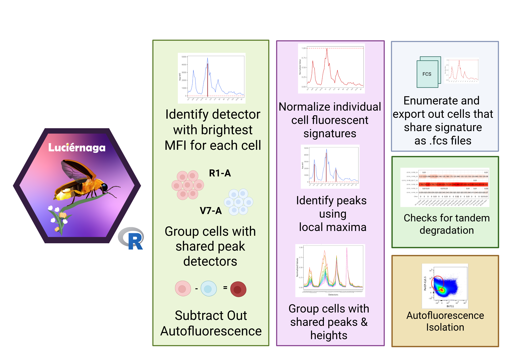

::: {style="text-align: right;"}
[](https://www.gnu.org/licenses/agpl-3.0.en.html) [](http://creativecommons.org/licenses/by-sa/4.0/)
:::

For the YouTube livestream schedule, see [here](https://www.youtube.com/@cytometryinr)

For screen-shot slides, click [here]()

<br>

---

# Background

Due to the sheer number of `plotly` `ggplotly()` interactive plots that would need to be loaded by the website if we had visualized all the `LuciernagaIntegration()` plots for the 29-fluorophore panel in one webpage, we have broken the exploration of the fluorophore outputs by laser. This walk-through if for the "Violet" laser.

- To return to the main walk-through (including UV fluorophores), click [here](/course/SDY3080/LuciernagaIntegration.qmd)
- For the violet fluorophore walk-through, click [here](/course/SDY3080/LuciernagaIntegration_Violet.qmd)
- For the blue fluorophore walk-through, click [here](/course/SDY3080/LuciernagaIntegration_Blue.qmd)
- For the yellow-green fluorophore walk-through, click [here](/course/SDY3080/LuciernagaIntegration_YellowGreen.qmd)
- For the red fluorophore walk-through, click [here](/course/SDY3080/LuciernagaIntegration_Red.qmd)
- For the unstained samples walk-through, click [here](/course/SDY3080/LuciernagaIntegration_Unstained.qmd)

# Walk-through

## Set Up

Attach your R packages to the local environment via the `library()` call. 

```{r}
library(dplyr)
library(purrr)
library(flowWorkspace)
library(Luciernaga)
library(ggplot2)
```

Designate your file paths to the storage and output folder locations. 

```{r}
StorageLocation <- file.path("course", "SDY3080", "data", "SDY3080")
#StorageLocation <- file.path("data", "SDY3080")

OutputLocation <- file.path("course", "SDY3080", "outputs")
#OutputLocation <- file.path("outputs")
```

Bring in the pre-gated GatingSet object (which was carried out as part of the [Signature Matrices](/course/SDY3080/SignatureMatrices.qmd) walkthrough).

```{r}
CellSCPath <- file.path(OutputLocation, "CellsSC_GS_Amplified.gs")
CellsSC_GatingSet <- load_gs(CellSCPath)
```

And bring in the template needed to run the `LuciernagaIntegration()` wrapper function. 

```{r}
#| echo: FALSE
SaveThisTemplateHere <- file.path(OutputLocation, "KeptCells.csv")
KeptCells <- read.csv(SaveThisTemplateHere, check.names=FALSE)
```

And with that, we are set! 

### Violet


Having completed looking at the fluorophores whose primary detector is on the Ultra Violet laser, we can now move on to the Violet laser. One thing to keep in mind is that for many of the cell types we work with will have autofluorescence around the "V7-A" or "V8-A" detector (especially after fixation). 

This is important to keep in mind, because behind the scenes `LuciernagaIntegration()` returns everything, grouped by peak detector, with additional peaks grouped on the basis of shared detector of relative similar height. 



Given that not all cells will stain for the fluorophore, this means we will be getting back both signatures with peaks for the "fluorophore", but also for "autofluorescence". And in the case of the most autofluorescent similar fluorophores (BUV496, BV510, etc.) these might overlap.

Behind the scenes, `LuciernagaQC()` uses an Autofluorescence overlap data.frame ("AFOverlap") to helps handle these overlap cases, removing known autofluorescence detectors from consideration, barring inclusion of the fluorophore with known overlap (like BV510) is present, in which case it will return signatures from that peak. 

```{r}
AFOverlap <- data.frame(Fluorophore=c("Unstained", "BV510"),
                               MainDetector=c("UV7-A, V7-A, B3-A", "V7-A"))

AFOverlap
```

While this approach works well for most cases, we have encountered examples where rare autofluorescences also make an appearance around "V3-A" and "V10-A". Which can cause additional overlaps with other fluorophores, which may require updating of the AFOverlap data.frame. 

So if we encounter an output that is odd, it could be degradation, or it could be an odd cell subset making some interesting molecule. 

And with those words of context/caution, lets get started. 


#### BV421

Getting us started on the violet laser is the [BV421](https://www.biolegend.com/en-us/products/brilliant-violet-421-anti-human-cd127-il-7ralpha-antibody-7155) fluorophore, conjugated to [CD127](https://en.wikipedia.org/wiki/Interleukin-7_receptor-%CE%B1) for this panel. Lets go ahead and dive right in an see what information we can glean from this cell single-color control.

```{r}
#| eval: TRUE
#| error: TRUE

BV421 <- LuciernagaIntegration(template=KeptCells[8,], gs=CellsSC_GatingSet,
 GuessSimilar=TRUE)
```

```{r}
UpdatedAFOVerlap <- data.frame(Fluorophore=c("Unstained", "BV421"),
                               MainDetector=c("UV7-A, V7-A, B3-A", "V3-A"))
```

```{r}
BV421 <- LuciernagaIntegration(template=KeptCells[8,], gs=CellsSC_GatingSet,
 GuessSimilar=TRUE, AFOverlap=UpdatedAFOVerlap)[[1]] # Square brackets to loose list notation
```

```{r}
plotly::ggplotly(BV421$LinearSlices_Plot)
```


#### Pacific Blue

Following that deep-dive, lets move on to the next Fluorophore, [Pacific Blue](https://www.biolegend.com/en-us/products/pacific-blue-anti-human-cd14-antibody-2853), which in this case was conjugated with [CD14](https://en.wikipedia.org/wiki/CD14). Consequently, it is going to be found primarily on the monocytes. Since its using an internal gate, we may potentially encounter issues of discrepant autofluorescences, since within that gate, cells that are CD14- are either non-classical monocytes or some dendritic cell subsets, which may have their own autofluorescences. 

```{r}
#| eval: FALSE
UpdatedAFOVerlap <- data.frame(Fluorophore=c("Unstained", "Pacific Blue"),
                               MainDetector=c("UV7-A, V7-A, B3-A", "V3-A"))

PacificBlue <- LuciernagaIntegration(template=KeptCells[9,], gs=CellsSC_GatingSet, GuessSimilar=TRUE)[[1]] # Square brackets to loose list notation
```

Also bugged, on to the next for now!


#### BV480

Next up, we have [BV480](bdbiosciences.com/en-us/products/reagents/flow-cytometry-reagents/research-reagents/single-color-antibodies-ruo/bv480-mouse-anti-human-cd161.748279), which was direct conjugated to [CD161](https://en.wikipedia.org/wiki/KLRB1). While a lot of T and NK cells will be positive for CD161, Mucosal-associated Invariant Cells would be bright for this marker. However, like other innate-like T cells, their abundance will vary from donor to donor, so without prior information, we don't know how many we will encounter for this adult PBMC donor. 

```{r}
BV480 <- LuciernagaIntegration(template=KeptCells[10,], gs=CellsSC_GatingSet, GuessSimilar=TRUE)[[1]] # Square brackets to loose list notation
```

Lets first take a look at the "LinearSlices_Plot", to see what effect would have been on the signature if we had split the region we had grabbed in our "positive" gate into 10% bins across. 

```{r}
Plot <- BV480$LinearSlices_Plot
plotly::ggplotly(Plot)
```

Looking at the signatures taken from each 10% bin, we can see that most appear relatively similar, with only some small impact from residual autofluorescence at the usual spots, similar to what we have previously seen for CD69 and Vdelta2.

Having noted this, lets check out the `LuciernagaQC()` grouped individual cell normalized signatures output stored under "LuciernagaQC_Signatures". 

```{r}
Plot <- BV480$LuciernagaQC_Signatures
plotly::ggplotly(Plot)
```

As anticipated, upon the `LuciernagaQC()` rounding, these small differenes end up producing two variant signatures. Lets visualize this same plot in an alternative fashion, checking to see where the median signature ends up by comparison. 

```{r}
Plot <- BV480$LuciernagaQC_AmalgamatedPlot
plotly::ggplotly(Plot)
```

Which likely aligns with proportion of cells within our positive gated region as distributed across our signature variants

```{r}
Plot <- BV480$ProportionPlot
plotly::ggplotly(Plot)
```

And before moving on, lets see how the "Average" compares to the reference signature using `QC_WhatsThis()`

```{r}
Data <- BV480$AveragedSignature_Data 
```

```{r}
QC_WhatsThis(x="Average", columnname="Cluster", data=Data, NumberHits=5, NumberDetectors=64, returnPlots=FALSE)
```

:::{.callout-tip title="Pass"}
No issues were found with this particular fluorophore, everything in terms of the normalized signature appearing relatively uniform and consistent. 
:::


#### BV510

Next up, we have [BV510](https://www.biolegend.com/en-us/products/brilliant-violet-510-anti-human-cd45ra-antibody-8007), which is conjugated to [CD45RA](https://en.wikipedia.org/wiki/PTPRC). Normally, this fluorophore alongside BUV496 is the most similar to autofluorescence, so any variation that occurs is likely to affect it. However, being paired with CD45RA, it will be fairly bright across the board. We will see if we can find anything interesting while exploring it.  

```{r}
UpdatedAFOVerlap <- data.frame(Fluorophore=c("Unstained", "BV510"),
                               MainDetector=c("UV7-A, V7-A, B3-A", "V7-A"))

BV510 <- LuciernagaIntegration(template=KeptCells[11,], gs=CellsSC_GatingSet, GuessSimilar=TRUE)[[1]] # Square brackets to loose list notation
```


#### BV605

Next up, we have [BV605](https://www.biolegend.com/en-us/products/brilliant-violet-605-anti-human-cd56-ncam-antibody-12019), which is conjugated to [CD56](https://en.wikipedia.org/wiki/Neural_cell_adhesion_molecule). Given the presence of Natural Killer (NK) cells in the samples, this should be bright, but similar to what we saw for CD161, the proportion of the bright population might vary across particular donors. 

```{r}
BV605 <- LuciernagaIntegration(template=KeptCells[12,], gs=CellsSC_GatingSet, GuessSimilar=TRUE)[[1]] # Square brackets to loose list notation
```

Lets first take a look at the "LinearSlices_Plot", to see what effect would have been on the signature if we had split the region we had grabbed in our "positive" gate into 10% bins across. 

```{r}
Plot <- BV605$LinearSlices_Plot
plotly::ggplotly(Plot)
```

From the signatures we retrieve from the 10% bins, we can see some autofluorescence residual being left in the shoulder of the BV605 primary detector, ranging from roughly the V5 through V8 detectors. While not as neglible as what we saw for BUV563 CD69, it's not quite a step ladder appearance as we saw for BUV395 CD62L. 

Having noted this, lets check out the `LuciernagaQC()` grouped individual cell normalized signatures output stored under "LuciernagaQC_Signatures". 

```{r}
Plot <- BV605$LuciernagaQC_Signatures
plotly::ggplotly(Plot)
```

Glancing at the retrieved signatures, we find "V10_10-YG3_04-UV10_03" is behaving fluorophore like, while "V10_10-YG3_04-UV9_02" is showing more residual autofluorescence contribution. Interestingly, the "V10_10-YG3_04-UV10_02" signature variant is showing a ... "Count" column. Cleanup for that data.frame being passed please! 

Lets visualize this same plot in an alternative fashion, checking to see where the median signature ends up by comparison. 

```{r}
Plot <- BV605$LuciernagaQC_AmalgamatedPlot
plotly::ggplotly(Plot)
```

So the average is a little above the "V10_10-YG3_04-UV10_03", which likely reflects proportion of cells within our positive gated region as they were distributed across our signature variants. 

```{r}
Plot <- BV605$ProportionPlot
plotly::ggplotly(Plot)
```

Lets retrieve the underlying data for this plot, and keep the Average, as well as variants with minimal and maxinum autofluorescence contribution of the autofluorescence peak. 

```{r}
Data <- BV605$AveragedSignature_Data |>
   filter(Cluster %in% c("V10_10-YG3_04-UV10_03", "Average", "V10_10-YG3_04-UV9_02"))
```

Lets pass these individually to `QC_SimilarFluorophores()` and gage the difference. 

```{r}
QC_WhatsThis(x="V10_10-YG3_04-UV10_03", columnname="Cluster", data=Data, NumberHits=5, NumberDetectors=64, returnPlots=FALSE)
```

```{r}
QC_WhatsThis(x="Average", columnname="Cluster", data=Data, NumberHits=5, NumberDetectors=64, returnPlots=FALSE)
```

```{r}
QC_WhatsThis(x="V10_10-YG3_04-UV9_02", columnname="Cluster", data=Data, NumberHits=5, NumberDetectors=64, returnPlots=FALSE)
```

So compared to the standard reference, the signatures go from 0.97, 0.96 to 0.89 for the signature variant incorporating residual autofluorescence. When we compare our signature to the reference, we can see there is still substantially more signal present from V1 through V8. Whether this is still residual left over from autofluorescence, or something due to the tandem batch, is what we will need to determine at the time of unmixing.

```{r}
Plot <- QC_WhatsThis(x="V10_10-YG3_04-UV10_03", columnname="Cluster", data=Data, NumberHits=5, NumberDetectors=64, returnPlots=TRUE)
plotly::ggplotly(Plot[[2]])
```

Before we go, lets visualized the difference in these angles, to better understand visually the difference in cosine values. 

```{r}
#| code-fold: TRUE
cos_vals <- c(1, 0.97, 0.96, 0.89)
theta <- acos(cos_vals)

df <- data.frame(
  label = paste0("cos = ", cos_vals),
  angle_deg = round(theta * 180 / pi, 1),
  x = sin(theta),
  y = cos(theta)
)

ggplot(df) +
  geom_segment(aes(x = 0, y = 0, xend = x, yend = y, color = label),
               arrow = arrow(length = unit(0.25, "cm")),
               linewidth = 1) +
  coord_fixed(xlim = c(-0.1, 1), ylim = c(-0.1, 1.1)) +
  geom_hline(yintercept = 0, color = "grey80") +
  geom_vline(xintercept = 0, color = "grey80") +
  labs(x = NULL, y = NULL, color = "Vector",
       title = NULL) +
  theme_bw()
```

:::{.callout-caution title="Caution"}
While not our main priority, this combination of antigen x fluorophore based on how we gated seems a little dim, which is leaving it sucescptible to autofluorescence residuals sinking into the signature. One thing we can attempt to ameliorate the issue would be to shift the gate further to the right (or increasing the antibody concentration a bit) to try to reduce this possibility. 
:::


#### BV650

Next up, we have [BV650](https://www.biolegend.com/en-us/products/brilliant-violet-650-anti-human-cd197-ccr7-antibody-8509), conjugated to [CCR7](https://en.wikipedia.org/wiki/C-C_chemokine_receptor_type_7). With it's primary detector on V10, it is out of the range for most of the autofluorescence, so we should start seeing any autofluorescence residual peaks more clearly going forward. 

```{r}
BV650 <- LuciernagaIntegration(template=KeptCells[13,], gs=CellsSC_GatingSet, GuessSimilar=TRUE)[[1]] # Square brackets to loose list notation
```

Lets first take a look at the "LinearSlices_Plot", to see what effect would have been on the signature if we had split the region we had grabbed in our "positive" gate into 10% bins across. 

```{r}
Plot <- BV650$LinearSlices_Plot
plotly::ggplotly(Plot)
```

As we have seen for the other fluorophores, consistent signal across the board for the fluorophore peaks, with a bit of step-ladder appearance for the V7 detector where the autofluorescent peak can be found for the cells in this intracellular staining panel. 


Having noted this, lets check out the `LuciernagaQC()` grouped individual cell normalized signatures output stored under "LuciernagaQC_Signatures". 

```{r}
Plot <- BV650$LuciernagaQC_Signatures
plotly::ggplotly(Plot)
```

All things said and done, after passing through `LuciernagaQC()` everything round up or down to reflect two signature variants for V7.


Lets visualize this same plot in an alternative fashion, checking to see where the median signature ends up by comparison. 

```{r}
Plot <- BV650$LuciernagaQC_AmalgamatedPlot
plotly::ggplotly(Plot)
```

Which in turn, reflects the proportion of cells within our positive gate that were grouped together on the basis of shared signature at the individual cell level. 

```{r}
Plot <- BV650$ProportionPlot
plotly::ggplotly(Plot)
```


Lets go ahead and compare both signature variants vs. each other using `QC_WhatsThis()`. 

```{r}
Data <- BV650$AveragedSignature_Data
```

```{r}
QC_WhatsThis(x="V11_10-YG4_03-UV11_02", columnname="Cluster", data=Data, NumberHits=5, NumberDetectors=64, returnPlots=FALSE)
```

```{r}
QC_WhatsThis(x="Average", columnname="Cluster", data=Data, NumberHits=5, NumberDetectors=64, returnPlots=FALSE)
```

```{r}
QC_WhatsThis(x="V11_10-YG4_02-UV11_02", columnname="Cluster", data=Data, NumberHits=5, NumberDetectors=64, returnPlots=FALSE)
```

Consistently a cosine of 0.98 across the board.

```{r}
Plot <- QC_WhatsThis(x="Average", columnname="Cluster", data=Data, NumberHits=5, NumberDetectors=64, returnPlots=TRUE)
plotly::ggplotly(Plot[[2]])
```


 If we visualized the difference in these angles, we would see the following

```{r}
#| code-fold: TRUE
cos_vals <- c(1, 0.98)
theta <- acos(cos_vals)

df <- data.frame(
  label = paste0("cos = ", cos_vals),
  angle_deg = round(theta * 180 / pi, 1),
  x = sin(theta),
  y = cos(theta)
)

ggplot(df) +
  geom_segment(aes(x = 0, y = 0, xend = x, yend = y, color = label),
               arrow = arrow(length = unit(0.25, "cm")),
               linewidth = 1) +
  coord_fixed(xlim = c(-0.1, 1), ylim = c(-0.1, 1.1)) +
  geom_hline(yintercept = 0, color = "grey80") +
  geom_vline(xintercept = 0, color = "grey80") +
  labs(x = NULL, y = NULL, color = "Vector",
       title = NULL) +
  theme_bw()
```

:::{.callout-tip title="Pass"}
Overall, fluorophore is in consistent shape. It is showing some low level autofluorescence residuals vs. the reference, but will likely have a minor effect on a panel of this size. 
:::


#### BV711

Continuing into the increasingly whacky world of Violet tandem dyes, we have [BV711](bdbiosciences.com/en-us/products/reagents/flow-cytometry-reagents/research-reagents/single-color-antibodies-ruo/bv711-mouse-anti-human-cd7.564018), which is conjugated to [CD7](https://en.wikipedia.org/wiki/CD7). CD7 should be bright for both T cells and NK cells. 

```{r}
BV711 <- LuciernagaIntegration(template=KeptCells[14,], gs=CellsSC_GatingSet, GuessSimilar=TRUE)[[1]] # Square brackets to loose list notation
```

Lets first take a look at the "LinearSlices_Plot", to see what effect would have been on the signature if we had split the region we had grabbed in our "positive" gate into 10% bins across. 

```{r}
Plot <- BV711$LinearSlices_Plot
plotly::ggplotly(Plot)
```

As expected for this antigen x fluorophore combination, everything is bright, so any autofluorescence residual leftovers contribute little to the overall signature. 

Having noted this, lets check out the `LuciernagaQC()` grouped individual cell normalized signatures output stored under "LuciernagaQC_Signatures". 

```{r}
Plot <- BV711$LuciernagaQC_Signatures
plotly::ggplotly(Plot)
```

As expected, the little autofluorescence variation we saw was minor, and is reflected by the retrieval of only two variant signatures that are likely result of the rounding approach taken by `LuciernagaQC()`. 

```{r}
Plot <- BV711$LuciernagaQC_AmalgamatedPlot
plotly::ggplotly(Plot)
```

To wrap up, lets compare vs. the reference signature using `QC_WhatsThis()`

```{r}
Data <- BV711$AveragedSignature_Data
```

```{r}
Plots <- QC_WhatsThis(x="Average", columnname="Cluster", data=Data, NumberHits=5, NumberDetectors=64, returnPlots=TRUE)
Plots[[1]]
plotly::ggplotly(Plots[[2]])
```

:::{.callout-tip title="Pass"}
Only minor differences noticed vs. the reference, and everything in terms of the signature of the cells within our gated region appears to be consistent. 
:::

#### BV750

Next up, we have [BV750](https://www.bdbiosciences.com/en-us/products/reagents/flow-cytometry-reagents/research-reagents/single-color-antibodies-ruo/bv750-mouse-anti-human-ifn.566357?tab=product_details), which is conjugated to [IFNg](https://en.wikipedia.org/wiki/Interferon_gamma). Given that this cell single-color control was prepared with adult donor PBMCs, stimulated with PMA-ionomycin, we expect the signal to be bright. 

```{r}
BV750 <- LuciernagaIntegration(template=KeptCells[15,], gs=CellsSC_GatingSet, GuessSimilar=TRUE)[[1]] # Square brackets to loose list notation
```

Lets first take a look at the "LinearSlices_Plot", to see what effect would have been on the signature if we had split the region we had grabbed in our "positive" gate into 10% bins across. 

```{r}
Plot <- BV750$LinearSlices_Plot
plotly::ggplotly(Plot)
```

The 10% bins within our gated region show minimal differences in signature. Lets go ahead and verify this via the `LuciernagaQC()` grouped individual cell normalized signatures output stored under "LuciernagaQC_Signatures". 

```{r}
Plot <- BV750$LuciernagaQC_Signatures
plotly::ggplotly(Plot)
```

Lets visualize this same plot in an alternative fashion, checking to see where the median signature ends up by comparison. 

```{r}
Plot <- BV750$LuciernagaQC_AmalgamatedPlot
plotly::ggplotly(Plot)
```

And for completionist sake, lets compare vs. the reference signature. 
 
```{r}
Data <- BV750$AveragedSignature_Data
```

```{r}
Plot <- QC_WhatsThis(x="Average", columnname="Cluster", data=Data, NumberHits=5, NumberDetectors=64, returnPlots=TRUE)
Plot[[1]]
plotly::ggplotly(Plot[[2]])
```

:::{.callout-tip title="Pass"}
The signature we retrieved from our gate matches that of the reference signature, and we saw minimal variation. So this fluorophore appears to be in good condition. 
:::

#### BV786

Last in the violet fluorophores, we have [BV786](https://www.bdbiosciences.com/en-us/products/reagents/flow-cytometry-reagents/research-reagents/single-color-antibodies-ruo/bv786-mouse-anti-human-cd196-ccr6.563704), conjugated with [CCR6](https://en.wikipedia.org/wiki/C-C_chemokine_receptor_type_6). CCR6 while not as high density as other markers, will still be bright for the cells that express it, but may vary in proportion depending on the donor. 

```{r}
BV786 <- LuciernagaIntegration(template=KeptCells[16,], gs=CellsSC_GatingSet, GuessSimilar=TRUE)[[1]] # Square brackets to loose list notation
```

Lets first take a look at the "LinearSlices_Plot", to see what effect would have been on the signature if we had split the region we had grabbed in our "positive" gate into 10% bins across. 

```{r}
Plot <- BV786$LinearSlices_Plot
plotly::ggplotly(Plot)
```

From the 10% bins, we can see a bit of variation around the V7 detector from residual autofluorescence, but still on the minor end overall. 

Having noted this, lets check out the `LuciernagaQC()` grouped individual cell normalized signatures output stored under "LuciernagaQC_Signatures". 

```{r}
Plot <- BV786$LuciernagaQC_Signatures
plotly::ggplotly(Plot)
```

We get a step-ladder appearance to out signature variance, with the "V15_10-V7_03-UV15_02" showing the most contribution from the leftover autofluorescence. 

Lets visualize this same plot in an alternative fashion, checking to see where the median signature ends up by comparison. 

```{r}
Plot <- BV786$LuciernagaQC_AmalgamatedPlot
plotly::ggplotly(Plot)
```

So it looks like the average ends up between the signature variants. Let's verify the proportion of cells within our positive gated region as distributed across our signature variants

```{r}
Plot <- BV786$ProportionPlot
plotly::ggplotly(Plot)
```

Lets retrieve the underlying data for this plot, and keep the Average, as well as variants with minimal and maxinum autofluorescence contribution of the autofluorescence peak. 

```{r}
Data <- BV786$AveragedSignature_Data |>
   filter(Cluster %in% c("V15_10-UV15_02", "Average"))
```

Lets pass these individually to `QC_SimilarFluorophores()` and gage the difference. 

```{r}
QC_WhatsThis(x="V15_10-UV15_02", columnname="Cluster", data=Data, NumberHits=5, NumberDetectors=64, returnPlots=FALSE)
```

```{r}
Plot <- QC_WhatsThis(x="Average", columnname="Cluster", data=Data, NumberHits=5, NumberDetectors=64, returnPlots=TRUE)
Plot[[1]]
plotly::ggplotly(Plot[[2]])
```

If we visualized the difference in these angles, we would see the following

```{r}
#| code-fold: TRUE
cos_vals <- c(1, 0.98, 0.97)
theta <- acos(cos_vals)

df <- data.frame(
  label = paste0("cos = ", cos_vals),
  angle_deg = round(theta * 180 / pi, 1),
  x = sin(theta),
  y = cos(theta)
)

ggplot(df) +
  geom_segment(aes(x = 0, y = 0, xend = x, yend = y, color = label),
               arrow = arrow(length = unit(0.25, "cm")),
               linewidth = 1) +
  coord_fixed(xlim = c(-0.1, 1), ylim = c(-0.1, 1.1)) +
  geom_hline(yintercept = 0, color = "grey80") +
  geom_vline(xintercept = 0, color = "grey80") +
  labs(x = NULL, y = NULL, color = "Vector",
       title = NULL) +
  theme_bw()
```

:::{.callout-tip title="Pass"}
Fluorophore is in good condition overall, with minor autofluorescence residuals compared to the reference present. Good enough for now. 
:::

# Redirects

Due to the sheer number of `plotly` `ggplotly()` plots that would need to be loaded by the website if we had visualized all the `LuciernagaIntegration()` plots for the 29-fluorophore panel in one webpage, we have broken the exploration of the fluorophore outputs by laser. This walk-through if for the Unstained controls. 

- To return to the main walk-through (including UV fluorophores), click [here](/course/SDY3080/LuciernagaIntegration.qmd)
- For the violet fluorophore walk-through, click [here](/course/SDY3080/LuciernagaIntegration_Violet.qmd)
- For the blue fluorophore walk-through, click [here](/course/SDY3080/LuciernagaIntegration_Blue.qmd)
- For the yellow-green fluorophore walk-through, click [here](/course/SDY3080/LuciernagaIntegration_YellowGreen.qmd)
- For the red fluorophore walk-through, click [here](/course/SDY3080/LuciernagaIntegration_Red.qmd)
- For the unstained samples walk-through, click [here](/course/SDY3080/LuciernagaIntegration_Unstained.qmd)


# Additional Resources

[Luciernaga Vignette - Reference Library](https://davidrach.github.io/Luciernaga/articles/QualityControl.html#comparing-normalized-signatures)

[Luciernaga Vignette - Fluorescent Signatures](https://davidrach.github.io/Luciernaga/articles/FluorescenceSignatures.html)

::: {style="text-align: right;"}
[](https://www.gnu.org/licenses/agpl-3.0.en.html) [](http://creativecommons.org/licenses/by-sa/4.0/)
:::
